# Story Gym – Full Testing Documentation

## Overview

This document provides a structured and comprehensive testing process for the **Story Gym** Django application.

The purpose of this file is to verify that the application works correctly across:
- functionality
- usability
- responsiveness
- authentication
- permissions
- data-driven content
- defensive and edge-case behaviour

Unlike a static front-end project, Story Gym includes **database-backed features**, **user accounts**, **CRUD functionality**, **comments**, **ratings**, **search/filter/sort**, and a **password reset flow**. For this reason, testing covers both visual behaviour and Django-specific workflows.

This file is written in a **page-by-page format** so the testing process mirrors the actual user journey through the site.

---

## Test Setup (applies to every table below)

### Viewports (DevTools → Toggle device toolbar)
- **Large / Desktop:** 1280×800 (also spot-check 1440×900)
- **Medium / Tablet:** 768×1024 (Lenovo Tab M10 Plus preset)
- **Small / Mobile:** 360×800 (Android) and 390×844 (Samsung Galaxy S25 Ultra preset)

### Browsers
- Chrome (latest)
- Firefox (latest)

### Common DevTools tools used
- **Elements → Styles/Computed**: check font size, line-height, spacing, overflow, fixed widths, and background behaviour
- **Console**: check JavaScript errors/warnings during page load and interactions
- **Network**: confirm CSS, JS, image assets, form posts, redirects, and password reset requests succeed or fail gracefully
- **Application / Storage**: confirm session-related behaviour where relevant
- **Lighthouse**: spot-check accessibility, best practices, and layout quality after major changes
- **Rendering/Emulation**: check zoom, DPR, reduced motion, and touch simulation

### Accounts used during testing
To test authentication and permissions correctly, three accounts should be prepared:

- **User A** – standard registered user
- **User B** – second standard registered user
- **Admin** – superuser account for `/admin/` checks

### Data setup used during testing
Before running the full test suite, prepare the following records:
- at least **2 published stories** by User A
- at least **1 published story** by User B
- at least **1 draft story**
- stories in **different genres**
- at least **1 story with no comments**
- at least **1 story with multiple comments**
- at least **1 story already rated**
- at least **1 repository search term that returns no results**

### Pass / Fail notes
- Use **Pass** only if the expected outcome is met exactly.
- Use **Fail** if the result differs from the expectation and note the issue clearly.
- If a test mostly works but exposes a visual or usability weakness, record it under **Known Issues / Improvements**.

---

## Global Cross-Page Checks (run on every page)

These checks apply to all templates that inherit from the shared base template.

### Large Screen (Desktop ≥ 1024px)

| Test ID | What to test | Test steps (very specific) | Expected result | Pass / Fail |
|---|---|---|---|---|
| GX-L-01 | Navbar visibility | Open each main page and inspect navbar alignment | Navbar renders consistently; no broken alignment; links readable | Pass |
| GX-L-02 | Auth-based nav state | Log out → inspect navbar; log in → inspect navbar again | Logged-out view shows Login/Register; logged-in view shows greeting + Logout + navigation links | Pass |
| GX-L-03 | Footer visibility | Scroll to footer on every page | Social icons visible, aligned, and not overlapping footer text | Pass |
| GX-L-04 | External link behaviour | Click Facebook / Instagram / X links | External links open correctly; original site remains intact | Pass |
| GX-L-05 | Favicon presence | Check browser tab icon on multiple pages | Favicon is visible; no broken default tab icon | Pass |
| GX-L-06 | Console cleanliness | Navigate through main pages with Console open | No recurring JS errors caused by counters, ratings, mesh, or page layout | Fail - after debugging: Pass|
| GX-L-07 | Typography consistency | Compare headings, body text, buttons, and labels across templates | Consistent visual hierarchy with no abrupt style mismatches | Pass |
| GX-L-08 | Zoom resilience | Check key pages at 90%, 100%, 110%, and 125% browser zoom | No clipping, overlap, or unusable controls | Pass |
| GX-L-09 | Keyboard focus visibility | Tab through links, buttons, inputs, and selects | Visible focus state present; tab order follows page logic | Pass |
| GX-L-10 | Refresh behaviour | Hard refresh several pages | CSS, JS, and images reload correctly; no broken layout after refresh | Pass |

### Medium Screen (Tablet ~768px)

| Test ID | What to test | Test steps (very specific) | Expected result | Pass / Fail |
|---|---|---|---|---|
| GX-M-01 | Breakpoint transition | Resize from 820px → 768px → 740px | Layout adapts cleanly; navbar and content panels do not break | Pass |
| GX-M-02 | Navbar collapse | Use collapsed menu and open/close it repeatedly | Menu opens and closes reliably; links remain usable | Pass |
| GX-M-03 | Footer wrap | Inspect footer at tablet width | Icons remain clickable; footer text wraps neatly | Pass |
| GX-M-04 | Touch-target usability | Use touch simulation and tap nav links / buttons | Controls respond on first tap; no tiny hit areas | Pass |
| GX-M-05 | Horizontal overflow | Scroll all main pages horizontally and vertically | No unexpected horizontal scroll | Pass |

### Small Screen (Mobile ≤ 414px)

| Test ID | What to test | Test steps (very specific) | Expected result | Pass / Fail |
|---|---|---|---|---|
| GX-S-01 | No horizontal scroll anywhere | Swipe sideways on all key pages | No sideways overflow | Pass |
| GX-S-02 | Hamburger menu usability | Open and close mobile nav repeatedly | Menu behaves reliably; no trapped state | Pass |
| GX-S-03 | Tap-target size | Tap near edges of buttons and links | Taps register; controls are large enough for touch | Pass |
| GX-S-04 | Text wrapping | Check long titles, usernames, story titles, and form hints | Text wraps naturally; no clipped words or overlap | Pass |
| GX-S-05 | Performance feel | Navigate through several pages on mobile | No major lag, white flashes, or broken transitions | Pass |

---

## PAGE 1 — Home Page (`index.html`)

### Large Screen (Desktop ≥ 1024px)

| Test ID | What to test | Test steps (very specific) | Expected result | Pass / Fail |
|---|---|---|---|---|
| HP-L-01 | Page loads cleanly | Load home page → open DevTools Console | No console errors on initial load; page renders fully | Fail - after debugging: Pass |
| HP-L-02 | Hero heading readability | Inspect the main `h1` and supporting paragraph | Heading readable; text does not overlap image or CTA block | Pass |
| HP-L-03 | Hero image display | Inspect hero image | Image loads correctly; no blur, distortion, or broken file | Pass |
| HP-L-04 | Main CTA routing | Click hero “Start here” button | Redirects correctly to Randomizer page | Pass |
| HP-L-05 | Feature cards visibility | Scroll to three article cards | All three cards visible, aligned, and evenly spaced | Pass |
| HP-L-06 | Feature card images | Inspect all three images | Images load correctly; no stretching or accidental cropping | Pass |
| HP-L-07 | Article card links | Click each “Read more” button | Opens the correct article page | Pass |
| HP-L-08 | Quote section layout | Inspect quote section and CTA | Quote readable; CTA card visible and balanced | Pass |
| HP-L-09 | Explore stories CTA | Click “Explore stories” | Opens repository page correctly | Pass |
| HP-L-10 | Flash message behaviour | Trigger a success message and return to home page | Message appears clearly and does not break layout spacing | Pass |

### Medium Screen (Tablet ~768px)

| Test ID | What to test | Test steps (very specific) | Expected result | Pass / Fail |
|---|---|---|---|---|
| HP-M-01 | Hero reflow | Set viewport to 768×1024 | Hero columns reflow cleanly; no overlap | Pass |
| HP-M-02 | CTA block fit | Inspect CTA content at tablet width | CTA remains readable; button fully visible | Pass |
| HP-M-03 | Feature card stacking | Inspect feature cards at tablet width | Cards stack or resize consistently; spacing remains balanced | Pass |
| HP-M-04 | Quote section fit | Inspect quote section at 768px | Text remains readable and centered | Pass |
| HP-M-05 | Join section spacing | Inspect final join section | Section remains visually balanced and usable | Pass |

### Small Screen (Mobile ≤ 414px)

| Test ID | What to test | Test steps (very specific) | Expected result | Pass / Fail |
|---|---|---|---|---|
| HP-S-01 | No horizontal scroll | Set 360×800 and swipe horizontally | No sideways scroll | Pass |
| HP-S-02 | Hero readability | Check H1, intro, and image without zoom | Readable; no huge text pushing content off-screen | Pass |
| HP-S-03 | Feature card stacking | Scroll to article cards | Cards stack vertically with consistent spacing | Pass |
| HP-S-04 | Button tap targets | Tap all home CTAs | Buttons respond on first tap | Pass |
| HP-S-05 | Section spacing on mobile | Scroll from hero to footer | No sections collapse into each other; no clipped text | Pass |

---

## PAGE 2 — “What’s New?” Article (`article_whats_new.html`)

### Large Screen (Desktop ≥ 1024px)

| Test ID | What to test | Test steps (very specific) | Expected result | Pass / Fail |
|---|---|---|---|---|
| AWN-L-01 | Page loads cleanly | Open page and inspect Console | No console errors; page renders correctly | Pass |
| AWN-L-02 | Two-column layout | Inspect left and right columns | Columns align correctly; no overlap or imbalance | Pass |
| AWN-L-03 | Intro text readability | Read first content section | Paragraphs have good spacing and readable line length | Pass |
| AWN-L-04 | Overlay image section | Inspect “Be Part of the Journey” block | Overlay text remains readable over image | Pass |
| AWN-L-05 | Mailto link | Click email link | Default mail client opens correctly | Fail - after debugging: Pass|
| AWN-L-06 | “Coming Soon” block | Inspect heading, paragraph, and image | Content aligned correctly; image not distorted | Pass |
| AWN-L-07 | Final quote styling | Scroll to quote block | Quote remains visually distinct and centered | Pass |

### Medium Screen (Tablet ~768px)

| Test ID | What to test | Test steps (very specific) | Expected result | Pass / Fail |
|---|---|---|---|---|
| AWN-M-01 | Column reflow | Set 768×1024 | Columns stack or shrink cleanly; no overlap | Pass |
| AWN-M-02 | Overlay readability | Inspect overlay text at tablet width | Text remains legible and unclipped | Pass |
| AWN-M-03 | Mailto tap usability | Tap email link in touch simulation | Link easy to activate and visible | Pass |

### Small Screen (Mobile ≤ 414px)

| Test ID | What to test | Test steps (very specific) | Expected result | Pass / Fail |
|---|---|---|---|---|
| AWN-S-01 | Mobile stacking | View page at 360px width | All sections stack cleanly; no horizontal overflow | Pass |
| AWN-S-02 | Overlay image block on mobile | Inspect image + overlay | Text remains inside overlay and readable | Pass |
| AWN-S-03 | Paragraph wrapping | Inspect all long text blocks | Lines wrap naturally; no overflow | Pass |

---

## PAGE 3 — “Prompts for Storytelling” Article (`article_prompts_story.html`)

### Large Screen (Desktop ≥ 1024px)

| Test ID | What to test | Test steps (very specific) | Expected result | Pass / Fail |
|---|---|---|---|---|
| APS-L-01 | Page loads cleanly | Open page and inspect Console | No console errors | Pass |
| APS-L-02 | Hero banner structure | Inspect hero title, image, and text block | Hero remains aligned; image and text box balanced | Pass |
| APS-L-03 | Two-card row layout | Inspect second row | Cards align evenly; mini image remains proportional | Pass |
| APS-L-04 | Light / dark card contrast | Inspect split section | Text contrast remains readable on all card styles | Pass |
| APS-L-05 | Final CTA button | Click final “Start here” button | Navigates to Randomizer page correctly | Pass |
| APS-L-06 | Tips card readability | Inspect “A Few Helpful Hints” section | Text readable; no overlap with surrounding panel | Pass |

### Medium Screen (Tablet ~768px)

| Test ID | What to test | Test steps (very specific) | Expected result | Pass / Fail |
|---|---|---|---|---|
| APS-M-01 | Hero reflow on tablet | Inspect hero at 768px | Hero components stack/reflow cleanly | Pass |
| APS-M-02 | Card row reflow | Inspect multi-card rows | Cards remain readable; no squeezed text | Pass |
| APS-M-03 | Bottom split layout | Inspect final section | CTA remains visible and well spaced | Pass |

### Small Screen (Mobile ≤ 414px)

| Test ID | What to test | Test steps (very specific) | Expected result | Pass / Fail |
|---|---|---|---|---|
| APS-S-01 | No horizontal scroll | View at 360px and swipe sideways | No sideways overflow | Pass |
| APS-S-02 | Section stacking | Scroll through all rows | All boxes stack in a readable order | Pass |
| APS-S-03 | CTA tap usability | Tap “Start here” in final CTA | Button works on first tap | Pass |

---

## PAGE 4 — “Writing Tips” Article (`article_writing_tips.html`)

### Large Screen (Desktop ≥ 1024px)

| Test ID | What to test | Test steps (very specific) | Expected result | Pass / Fail |
|---|---|---|---|---|
| AWT-L-01 | Page loads cleanly | Open page and inspect Console | No console errors | Pass |
| AWT-L-02 | Hero split layout | Inspect hero title and overlay text box | Both sides align well against background image | Pass |
| AWT-L-03 | Side quote section | Inspect quote-line section | Quote remains centered and visually clear | Pass |
| AWT-L-04 | Main text block readability | Read central content area | Comfortable line spacing and no crowding | Pass |
| AWT-L-05 | Four-box grid | Inspect all four boxes | Cards align correctly; subtitles and lists readable | Pass |
| AWT-L-06 | Final quote block | Inspect bottom quote section | Quote remains centered and distinct | Pass |

### Medium Screen (Tablet ~768px)

| Test ID | What to test | Test steps (very specific) | Expected result | Pass / Fail |
|---|---|---|---|---|
| AWT-M-01 | Hero stack/reflow | Set viewport 768×1024 | Hero reflows cleanly with no clipping | Pass |
| AWT-M-02 | Split-section stacking | Inspect mid-row layout | Quote section and text section stack or resize correctly | Pass |
| AWT-M-03 | Four-box readability | Inspect box content at tablet width | Text remains readable; no overflow in list items | Pass |

### Small Screen (Mobile ≤ 414px)

| Test ID | What to test | Test steps (very specific) | Expected result | Pass / Fail |
|---|---|---|---|---|
| AWT-S-01 | No horizontal scroll | View at 360px and swipe sideways | No sideways overflow | Pass |
| AWT-S-02 | Box stacking order | Scroll down the full page | Boxes stack in a logical and readable sequence | Pass |
| AWT-S-03 | List readability on mobile | Inspect list items in grid section | Bullets and text remain readable without overlap | Pass |

---

## PAGE 5 — Login Page (`login.html`)

### Large Screen (Desktop ≥ 1024px)

| Test ID | What to test | Test steps (very specific) | Expected result | Pass / Fail |
|---|---|---|---|---|
| LP-L-01 | Page loads cleanly | Open login page → Console | No console errors; form renders correctly | Pass |
| LP-L-02 | Label/input alignment | Inspect username and password fields | Labels aligned correctly with inputs; no clipping | Pass |
| LP-L-03 | Empty submit handling | Submit with both fields empty | Form rejects invalid login; user remains on page | Pass |
| LP-L-04 | Invalid credentials | Enter wrong username/password | Error message shown; login blocked | Pass |
| LP-L-05 | Valid login flow | Enter valid User A credentials | User logs in successfully and redirect works | Pass |
| LP-L-06 | Forgot password link | Click “Forgot password?” | Redirects correctly to password reset form | Pass |
| LP-L-07 | Register link | Click “Create account” | Redirects correctly to register page | Pass |
| LP-L-08 | Autocomplete behaviour | Click into username/password fields | Browser respects autocomplete attributes appropriately | Pass |

### Medium Screen (Tablet ~768px)

| Test ID | What to test | Test steps (very specific) | Expected result | Pass / Fail |
|---|---|---|---|---|
| LP-M-01 | Layout collapse | Set viewport to 768×1024 | Two-column panel reflows cleanly into stacked layout | Pass |
| LP-M-02 | Form width | Inspect input width at tablet size | Inputs fit panel without overflow | Pass |
| LP-M-03 | Button alignment | Inspect login and signup buttons | Buttons remain centered and fully visible | Pass |

### Small Screen (Mobile ≤ 414px)

| Test ID | What to test | Test steps (very specific) | Expected result | Pass / Fail |
|---|---|---|---|---|
| LP-S-01 | Mobile usability | Open login page at 360px width | Form fully usable without horizontal scroll | Pass |
| LP-S-02 | Keyboard overlap | Focus username and password fields | Inputs remain visible when mobile keyboard appears | Pass |
| LP-S-03 | Full-width buttons | Inspect buttons on mobile | Buttons expand appropriately and remain tappable | Pass |

---

## PAGE 6 — Register Page (`register.html`)

### Large Screen (Desktop ≥ 1024px)

| Test ID | What to test | Test steps (very specific) | Expected result | Pass / Fail |
|---|---|---|---|---|
| RP-L-01 | Page loads cleanly | Open register page → Console | No console errors; form renders correctly | Pass |
| RP-L-02 | Form hint readability | Inspect hints for username, password, email, and DOB | Hints readable and visually associated with inputs | Pass |
| RP-L-03 | Empty submit handling | Submit form with all fields blank | Form errors shown; account not created | Pass |
| RP-L-04 | Username validation | Enter invalid username / existing username | Relevant validation message shown | Pass |
| RP-L-05 | Password mismatch | Enter different values in password fields | Validation error shown; registration blocked | Pass |
| RP-L-06 | Weak/invalid password | Enter password failing project rules | Validation error shown | Pass |
| RP-L-07 | Invalid email | Enter malformed email address | Validation error shown | Pass |
| RP-L-08 | DOB age restriction | Enter DOB below 18 or above 99 boundary if validation exists | Invalid age rejected with appropriate message | Pass |
| RP-L-09 | Valid registration | Enter complete valid data | New user account created successfully | Pass |
| RP-L-10 | Post-register redirect/message | Complete registration and follow redirect | Success message visible; user flow continues correctly | Pass |

### Medium Screen (Tablet ~768px)

| Test ID | What to test | Test steps (very specific) | Expected result | Pass / Fail |
|---|---|---|---|---|
| RP-M-01 | Panel fit on tablet | Inspect register panel at 768px | Panel fits viewport; no clipped text | Pass |
| RP-M-02 | Form spacing | Inspect vertical spacing between fields | Inputs and errors remain separated and readable | Pass |
| RP-M-03 | Date input usability | Tap date input / use picker | Date field remains usable and visible on tablet | Pass |

### Small Screen (Mobile ≤ 414px)

| Test ID | What to test | Test steps (very specific) | Expected result | Pass / Fail |
|---|---|---|---|---|
| RP-S-01 | Mobile form fit | Open register page on 360px width | All inputs fit screen; no horizontal overflow | Pass |
| RP-S-02 | Error message wrapping | Trigger multiple field errors | Error messages wrap cleanly and remain readable | Pass |
| RP-S-03 | Date picker visibility | Use mobile date picker | Native picker opens and closes correctly | Pass |

---

## PAGE 7 — Password Reset Request (`password_reset_form.html`)

### Large Screen (Desktop ≥ 1024px)

| Test ID | What to test | Test steps (very specific) | Expected result | Pass / Fail |
|---|---|---|---|---|
| PRF-L-01 | Page loads cleanly | Open reset form page | No console errors; form visible | Pass |
| PRF-L-02 | Empty submit handling | Submit with no email | Validation error shown or browser blocks invalid input | Pass |
| PRF-L-03 | Invalid email format | Enter malformed email and submit | Error shown; request blocked | Pass |
| PRF-L-04 | Existing email flow | Submit valid email attached to account | Redirects to “check your email” page | Pass |
| PRF-L-05 | Non-existing email flow | Submit email not linked to account | Same generic success page shown; no account leakage | Pass |
| PRF-L-06 | Back-to-login CTA | Click “Back to login” | Returns to login page correctly | Pass |

### Medium Screen (Tablet ~768px)

| Test ID | What to test | Test steps (very specific) | Expected result | Pass / Fail |
|---|---|---|---|---|
| PRF-M-01 | Layout collapse | Inspect reset form at tablet width | Panel stacks/reflows cleanly | Pass |
| PRF-M-02 | Input width | Inspect email field | Input fits panel without overflow | Pass |

### Small Screen (Mobile ≤ 414px)

| Test ID | What to test | Test steps (very specific) | Expected result | Pass / Fail |
|---|---|---|---|---|
| PRF-S-01 | Mobile fit | Open form at 360px width | No horizontal scroll; field and button fully visible | Pass |
| PRF-S-02 | Tap usability | Tap email field and submit button | Controls easy to use on mobile | Pass |

---

## PAGE 8 — Password Reset “Email Sent” (`password_reset_done.html`)

### Large Screen (Desktop ≥ 1024px)

| Test ID | What to test | Test steps (very specific) | Expected result | Pass / Fail |
|---|---|---|---|---|
| PRD-L-01 | Confirmation page load | Complete password reset request flow | “Check your email” page loads correctly | Pass |
| PRD-L-02 | Messaging clarity | Read explanatory text | Text is clear and does not reveal whether account exists | Pass |
| PRD-L-03 | Back to login CTA | Click “Back to login” | Redirects correctly to login page | Pass |

### Medium / Small Screen

| Test ID | What to test | Test steps (very specific) | Expected result | Pass / Fail |
|---|---|---|---|---|
| PRD-R-01 | Responsive panel fit | View on tablet and mobile | Layout remains readable and centered | Pass |

---

## PAGE 9 — Password Reset Confirm (`password_reset_confirm.html`)

### Large Screen (Desktop ≥ 1024px)

| Test ID | What to test | Test steps (very specific) | Expected result | Pass / Fail |
|---|---|---|---|---|
| PRC-L-01 | Valid link form display | Open a valid password reset link | New password form appears | Pass |
| PRC-L-02 | Empty submit handling | Submit with blank password fields | Errors shown; password not changed | Pass |
| PRC-L-03 | Mismatched passwords | Enter different values in two fields | Validation error shown | Pass |
| PRC-L-04 | Invalid password rules | Enter invalid password according to Django rules | Validation error shown | Pass |
| PRC-L-05 | Successful reset | Enter valid matching password twice | Password changed successfully | Pass |
| PRC-L-06 | Invalid / expired link branch | Open expired or malformed reset link | “Invalid or expired” message displayed; request-new-link CTA visible | Pass |
| PRC-L-07 | Request new link CTA | Click “Request a new link” | Redirects to reset form page | Pass |

### Medium / Small Screen

| Test ID | What to test | Test steps (very specific) | Expected result | Pass / Fail |
|---|---|---|---|---|
| PRC-R-01 | Responsive form fit | View valid and invalid-link states on tablet/mobile | Layout remains readable; buttons usable | Pass |

---

## PAGE 10 — Password Reset Complete (`password_reset_complete.html`)

### Large Screen (Desktop ≥ 1024px)

| Test ID | What to test | Test steps (very specific) | Expected result | Pass / Fail |
|---|---|---|---|---|
| PRCOMP-L-01 | Completion page load | Finish successful password reset | “Password changed” page loads correctly | Pass |
| PRCOMP-L-02 | Login CTA | Click “Log in” | Redirects correctly to login page | Pass |

### Medium / Small Screen

| Test ID | What to test | Test steps (very specific) | Expected result | Pass / Fail |
|---|---|---|---|---|
| PRCOMP-R-01 | Responsive fit | View page on tablet/mobile | Layout remains centered and readable | Pass |

---

## PAGE 11 — Randomizer (`randomizer.html`)

### Large Screen (Desktop ≥ 1024px)

| Test ID | What to test | Test steps (very specific) | Expected result | Pass / Fail |
|---|---|---|---|---|
| RZ-L-01 | Initial state page | Open randomizer without existing words in session | Intro page with “Start” button is shown | Pass |
| RZ-L-02 | Generate words flow | Click “Start” | Random prompt words are generated and result page appears | Pass |
| RZ-L-03 | Word count completeness | Inspect generated result card | Exactly six prompt elements display | Pass |
| RZ-L-04 | Visual spacing of words | Inspect randomizer word pills | Words wrap neatly; no overlap or clipping | Pass |
| RZ-L-05 | Write now CTA | Click “Write now” | Redirects correctly to story writing page | Pass |
| RZ-L-06 | Draw again behaviour | Click “Draw again” | New set of words appears; page does not crash | Pass |
| RZ-L-07 | Multiple rapid re-draws | Click “Draw again” repeatedly | No layout break, JS error, or duplicate-button bug | Pass |
| RZ-L-08 | No-session fallback | Clear session / open flow fresh | App safely shows initial state rather than broken result view | Pass |

### Medium Screen (Tablet ~768px)

| Test ID | What to test | Test steps (very specific) | Expected result | Pass / Fail |
|---|---|---|---|---|
| RZ-M-01 | Intro panel fit | Inspect intro layout on tablet | Panel remains centered and readable | Pass |
| RZ-M-02 | Result card fit | Generate words and inspect card | Word chips wrap correctly; buttons remain visible | Pass |
| RZ-M-03 | Button stacking | Inspect action cards at tablet width | Action buttons remain usable and aligned | Pass |

### Small Screen (Mobile ≤ 414px)

| Test ID | What to test | Test steps (very specific) | Expected result | Pass / Fail |
|---|---|---|---|---|
| RZ-S-01 | Mobile intro fit | Open initial randomizer page at 360px width | No horizontal scroll; content centered | Pass |
| RZ-S-02 | Word wrapping on mobile | Generate words and inspect result | Long/random words wrap cleanly within pills and card | Pass |
| RZ-S-03 | Action buttons on mobile | Tap “Write now” and “Draw again” | Buttons are large enough and respond on first tap | Pass |

---

## PAGE 12 — Story Editor / Write Page (`my_story.html`)

### Large Screen (Desktop ≥ 1024px)

| Test ID | What to test | Test steps (very specific) | Expected result | Pass / Fail |
|---|---|---|---|---|
| MS-L-01 | Page load with prompt words | Open story editor after using randomizer | Prompt words display correctly in header | Pass |
| MS-L-02 | Title input visibility | Inspect title field | Field visible, usable, and styled consistently | Pass |
| MS-L-03 | Genre select visibility | Inspect genre dropdown | Dropdown visible, labelled, and usable | Pass |
| MS-L-04 | Textarea usability | Click into story textarea and type long text | Textarea accepts input; no layout shift | Pass |
| MS-L-05 | Character counter works | Type into story field and observe counter | Counter updates in real time | Pass |
| MS-L-06 | Save draft flow | Use “Save for later” | Story saved as draft; no crash; success flow works | Pass |
| MS-L-07 | Publish flow | Use “Send to the world” | Story saved/published successfully | Pass |
| MS-L-08 | Clear story flow | Use “Nope, clear all” | Story content clears or expected flow executes safely | Pass |
| MS-L-09 | Draft-to-published edit branch | Open an existing published story in edit mode | Correct button state shown for editing/published branch | Pass |
| MS-L-10 | Edit mode delete button | Open existing story in edit mode | Delete button visible only where expected | Pass |
| MS-L-11 | Empty submission handling | Submit without required content/title as applicable | Validation prevents bad submission | Pass |
| MS-L-12 | Spaces-only input | Enter only spaces and attempt submit | Validation prevents invalid content if implemented | Fail - after debugging: Pass|
| MS-L-13 | Long content stress test | Paste very long story text | Layout remains usable; textarea and counter behave | Pass |
| MS-L-14 | Special characters/emoji | Enter punctuation, quotes, HTML-like text, emoji | Input accepted/displayed safely without breaking layout | Pass |

### Medium Screen (Tablet ~768px)

| Test ID | What to test | Test steps (very specific) | Expected result | Pass / Fail |
|---|---|---|---|---|
| MS-M-01 | Editor panel fit | Inspect story editor at 768px | Main panel fits cleanly with no clipping | Pass |
| MS-M-02 | Counter placement | Type text and inspect counter location | Counter remains anchored in visible position | Pass |
| MS-M-03 | Button wrapping | Inspect footer action buttons | Buttons wrap cleanly without overlap | Pass |
| MS-M-04 | Textarea height | Inspect textarea on tablet | Height remains usable for writing | Pass |

### Small Screen (Mobile ≤ 414px)

| Test ID | What to test | Test steps (very specific) | Expected result | Pass / Fail |
|---|---|---|---|---|
| MS-S-01 | Mobile editor fit | Open story editor on mobile | No horizontal scroll; title and textarea visible | Pass |
| MS-S-02 | Keyboard behaviour | Focus story textarea on mobile | Input remains visible when mobile keyboard appears | Pass |
| MS-S-03 | Full-width action buttons | Inspect footer buttons on mobile | Buttons stack vertically and remain tappable | Pass |
| MS-S-04 | Prompt header wrapping | Inspect generated words header on mobile | Long prompt line wraps without overflow | Pass |

---

## PAGE 13 — Story Preview + Comments (`preview_story.html`)

### Large Screen (Desktop ≥ 1024px)

| Test ID | What to test | Test steps (very specific) | Expected result | Pass / Fail |
|---|---|---|---|---|
| PV-L-01 | Story title display | Open preview page for published story | Title visible and centered correctly | Pass |
| PV-L-02 | Story meta block | Inspect generated words, genre, author, and date | Metadata displays correctly and wraps safely | Pass |
| PV-L-03 | Story content rendering | Inspect main story box | Story displays with preserved line breaks and readable spacing | Pass |
| PV-L-04 | Empty-comments state | Open story with no comments | “No comments yet.” message shown cleanly | Pass |
| PV-L-05 | Logged-out comment state | Log out and open preview page | Comment form hidden; login/register CTA shown instead | Pass |
| PV-L-06 | Logged-in comment state | Log in and open preview page | Comment form visible and usable | Pass |
| PV-L-07 | Comment character counter | Type into comment field | Counter updates in real time | Pass |
| PV-L-08 | Star rating UI | Click stars in rating widget | Visual stars update to selected rating | Pass |
| PV-L-09 | Submit valid comment | Enter text and submit | Comment appears in list after submit | Pass |
| PV-L-10 | Empty comment submit | Submit blank comment | Validation blocks submission | Pass |
| PV-L-11 | Spaces-only comment | Submit only spaces | Validation blocks submission if implemented | Fail - after debugging: Pass|
| PV-L-12 | Edit comment mode | Open own comment for editing | Form switches into edit mode; Cancel button visible | Pass |
| PV-L-13 | Cancel edit | Click Cancel while editing | Returns to normal preview page state | Pass |
| PV-L-14 | Delete own comment | Delete own comment | Comment removed successfully | Pass |
| PV-L-15 | Own comment action visibility | Inspect comments authored by logged-in user | Edit/Delete controls visible only on own comments | Pass |
| PV-L-16 | Other users’ comment protection | Log in as another user and inspect comments | Edit/Delete controls absent for comments not owned by current user | Pass |
| PV-L-17 | Story author rating restriction | Open own story as author | “You cannot rate your own story” message shown | Pass |
| PV-L-18 | Repeat rating restriction | Rate a story, then return | Repeat rating prevented according to app rules | Pass |
| PV-L-19 | Many comments stress test | Open story with many comments | Comment list remains readable and scrollable without layout break | Pass |
| PV-L-20 | Long comment text stress test | Add long comment text | Comment wraps safely; no overflow | Pass |

### Medium Screen (Tablet ~768px)

| Test ID | What to test | Test steps (very specific) | Expected result | Pass / Fail |
|---|---|---|---|---|
| PV-M-01 | Preview panel fit | Inspect story preview at 768px | Story panel remains readable and centered | Pass |
| PV-M-02 | Comments grid collapse | Inspect comments area | Two-column comment layout collapses cleanly to one column | Pass |
| PV-M-03 | Rating control fit | Use star rating UI at tablet width | Stars remain visible and tappable | Pass |
| PV-M-04 | Action button fit | Inspect Edit/Delete buttons in comment list | Buttons remain visible and aligned | Fail - after debugging: Pass|

### Small Screen (Mobile ≤ 414px)

| Test ID | What to test | Test steps (very specific) | Expected result | Pass / Fail |
|---|---|---|---|---|
| PV-S-01 | Story meta wrapping | Inspect metadata block on mobile | Metadata stacks without overlap | Pass |
| PV-S-02 | Story box readability | Scroll story content on mobile | Content remains readable; no clipped paragraphs | Pass |
| PV-S-03 | Comment form usability | Type comment on mobile | Textarea usable; keyboard does not hide essential controls | Pass |
| PV-S-04 | Rating/tap usability | Tap star rating on mobile | Stars respond correctly to touch | Pass |
| PV-S-05 | Comment buttons on mobile | Inspect Edit/Delete buttons | Buttons remain usable and not too small | Fail - after debugging: Pass|

---

## PAGE 14 — Repository (`repo.html`)

### Large Screen (Desktop ≥ 1024px)

| Test ID | What to test | Test steps (very specific) | Expected result | Pass / Fail |
|---|---|---|---|---|
| REPO-L-01 | Page loads cleanly | Open repository page → Console | No console errors; page renders fully | Pass |
| REPO-L-02 | Latest story block | Inspect latest published story preview | Latest story data displays correctly; read-more CTA visible | Pass |
| REPO-L-03 | No-latest fallback | Test state with no published stories if possible | Friendly fallback message shown | Pass |
| REPO-L-04 | Search field usability | Type query into title search field | Input accepts text and remains aligned | Pass |
| REPO-L-05 | Search with matching result | Submit search for known existing story title | Matching stories displayed correctly | Pass |
| REPO-L-06 | Search with no result | Submit query with no matches | “No results found” message shown correctly | Pass |
| REPO-L-07 | Sort newest | Select “Newest” and submit | Stories ordered newest first | Pass |
| REPO-L-08 | Sort oldest | Select “Oldest” and submit | Stories ordered oldest first | Pass |
| REPO-L-09 | Sort liked | Select “Most liked” and submit | Stories ordered by average rating/likes as implemented | Fail - after debugging: Pass |
| REPO-L-10 | Genre filter | Select genre and submit | Only matching stories displayed | Pass |
| REPO-L-11 | Combined search + filter | Use search + sort + genre together | Combined filtering works without breaking layout | Pass |
| REPO-L-12 | Clear button visibility | Apply query/sort and inspect clear button | Clear button appears when expected | Pass |
| REPO-L-13 | Clear filter action | Click clear button | Returns repository to default state | Pass |
| REPO-L-14 | Story row layout | Inspect repository rows with long titles | Titles wrap safely; metadata remains aligned | Pass |
| REPO-L-15 | Rating display | Inspect rows with and without ratings | Rated stories show value correctly; unrated show fallback text | Pass |
| REPO-L-16 | “More” CTA | Click More on a story row | Opens story preview page correctly | Pass |

### Medium Screen (Tablet ~768px)

| Test ID | What to test | Test steps (very specific) | Expected result | Pass / Fail |
|---|---|---|---|---|
| REPO-M-01 | Two-column panel collapse | Inspect repository at tablet width | Latest story and repository sections stack cleanly | Pass |
| REPO-M-02 | Search form reflow | Inspect search/sort/filter controls | Controls remain aligned and readable | Pass |
| REPO-M-03 | Story row wrapping | Inspect rows at tablet width | Title, author, date, and genre wrap without overlap | Pass |
| REPO-M-04 | Latest story text area | Inspect preview block | Text remains readable with no clipping | Pass |

### Small Screen (Mobile ≤ 414px)

| Test ID | What to test | Test steps (very specific) | Expected result | Pass / Fail |
|---|---|---|---|---|
| REPO-S-01 | Mobile repository fit | Open page on 360px width | No horizontal overflow | Pass |
| REPO-S-02 | Filter controls stacking | Inspect search/sort/filter row | Controls stack vertically and remain usable | Pass |
| REPO-S-03 | Story meta mobile layout | Inspect repository rows | Metadata rearranges cleanly; More button still accessible | Pass |
| REPO-S-04 | Search and clear on mobile | Search and then clear results | Both actions usable on touch devices | Pass |

---

## PAGE 15 — Account Page (`account.html`)

### Large Screen (Desktop ≥ 1024px)

| Test ID | What to test | Test steps (very specific) | Expected result | Pass / Fail |
|---|---|---|---|---|
| AC-L-01 | Auth protection | Open account page while logged out | Access blocked or redirected to login as expected | Pass |
| AC-L-02 | Welcome header | Log in and open account page | Username shown correctly in welcome heading | Pass |
| AC-L-03 | User repository list | Inspect stories list | User’s own stories appear correctly with dates/status | Pass |
| AC-L-04 | Empty repository fallback | Test account with no stories | “You do not have any stories yet.” shown cleanly | Pass |
| AC-L-05 | Published story actions | Inspect published story row | Open/Edit/Delete buttons visible where expected | Pass |
| AC-L-06 | Draft story actions | Inspect draft story row | Continue draft + Delete visible where expected | Pass |
| AC-L-07 | Delete confirmation | Use delete form on one story | Confirmation prompt appears before delete submits | Pass |
| AC-L-08 | Latest published story card | If user has latest published story, inspect extra card | View-latest CTA appears only when condition is met | Pass |
| AC-L-09 | “Start here” CTA | Click “Start here” in right-hand card | Redirects to randomizer page | Pass |
| AC-L-10 | “Get inspired” CTA | Click repository inspiration CTA | Redirects to public story repository | Pass |

### Medium Screen (Tablet ~768px)

| Test ID | What to test | Test steps (very specific) | Expected result | Pass / Fail |
|---|---|---|---|---|
| AC-M-01 | Layout collapse | Inspect account layout at tablet width | Main columns reflow cleanly | Pass |
| AC-M-02 | Story row fit | Inspect account rows on tablet | Date, title, and action buttons remain readable | Pass |
| AC-M-03 | Right card stacking | Inspect account CTA cards | Cards stack properly and remain balanced | Pass |

### Small Screen (Mobile ≤ 414px)

| Test ID | What to test | Test steps (very specific) | Expected result | Pass / Fail |
|---|---|---|---|---|
| AC-S-01 | Mobile fit | Open account page on 360px width | No horizontal scroll; content centered | Pass |
| AC-S-02 | Story action buttons | Inspect story rows on mobile | Buttons remain visible and tappable | Pass |
| AC-S-03 | Empty-state readability | Inspect no-story state on mobile | Fallback message remains readable and centered | Pass |

---

## PAGE 16 — Custom 404 Page (`404.html`)

### Large Screen (Desktop ≥ 1024px)

| Test ID | What to test | Test steps (very specific) | Expected result | Pass / Fail |
|---|---|---|---|---|
| E404-L-01 | Trigger 404 via invalid route | Open a non-existent internal URL | Custom 404 page loads correctly | Pass |
| E404-L-02 | Branding / visual consistency | Inspect 404 page styling | Page remains visually consistent with overall project style | Pass |
| E404-L-03 | Countdown visible | Inspect countdown area | Countdown text visible and readable | Pass |
| E404-L-04 | Countdown decreases | Wait and observe seconds value | Countdown decreases each second | Pass |
| E404-L-05 | Auto-redirect | Wait until countdown completes | User is redirected to homepage | Pass |
| E404-L-06 | Manual recovery link | Click homepage return link | Redirects immediately to homepage | Pass |

### Medium Screen (Tablet ~768px)

| Test ID | What to test | Test steps (very specific) | Expected result | Pass / Fail |
|---|---|---|---|---|
| E404-M-01 | Typography scaling | Inspect page at 768px width | “404” and supporting text remain readable and centered | Pass |
| E404-M-02 | Countdown and link fit | Inspect countdown and manual link | Both remain visible and unclipped | Pass |

### Small Screen (Mobile ≤ 414px)

| Test ID | What to test | Test steps (very specific) | Expected result | Pass / Fail |
|---|---|---|---|---|
| E404-S-01 | Mobile layout | View 404 page at 360px | No horizontal scroll; content centered | Pass |
| E404-S-02 | Countdown legibility | Inspect countdown on mobile | Readable without zoom; no overlap | Pass |
| E404-S-03 | Manual link tap | Tap homepage recovery link | Returns to homepage correctly | Pass |

---

## Django CRUD & Permission Testing

This section tests application rules that are not limited to one template, but are essential for a database-backed project.

### Story CRUD

| Test ID | What to test | Test steps (very specific) | Expected result | Pass / Fail |
|---|---|---|---|---|
| CRUD-ST-01 | Create story | Generate random words → write story → publish | New story is stored and visible in repository/preview | Pass |
| CRUD-ST-02 | Save draft | Create story and choose draft action | Story saved as draft and shown correctly on account page | Pass |
| CRUD-ST-03 | Update own story | Edit a story owned by User A | Changes saved and reflected immediately | Pass |
| CRUD-ST-04 | Delete own story | Delete a story owned by User A | Story removed successfully | Pass |
| CRUD-ST-05 | Back button after delete | Delete story then use browser Back | Deleted story does not reappear as valid content | Pass |
| CRUD-ST-06 | Deleted story URL | Delete story then open old preview URL | 404 or safe handling shown; no broken internal error | Pass |
| CRUD-ST-07 | Create story while logged out | Try to access write flow while logged out | Access blocked or redirected to login | Pass |
| CRUD-ST-08 | Edit other user’s story via URL | Log in as User B and open User A’s edit URL | Access denied, redirected, or 404 | Pass |
| CRUD-ST-09 | Delete other user’s story via URL | Log in as User B and submit delete for User A story | Access denied, redirected, or 404 | Pass |
| CRUD-ST-10 | Draft/published state branch | Change story state between draft and published | Correct actions and visibility update across pages | Pass |

### Comment CRUD / Rating Rules

| Test ID | What to test | Test steps (very specific) | Expected result | Pass / Fail |
|---|---|---|---|---|
| CRUD-CM-01 | Create comment | Logged in as User B, comment on User A story | Comment saved and appears correctly | Pass |
| CRUD-CM-02 | Edit own comment | Edit comment as its author | Comment updates successfully | Pass |
| CRUD-CM-03 | Delete own comment | Delete own comment | Comment removed successfully | Pass |
| CRUD-CM-04 | Edit other user’s comment | Log in as another user and inspect comment actions | Edit control absent or access denied | Pass |
| CRUD-CM-05 | Delete other user’s comment | Submit delete attempt for another user comment | Access denied or action unavailable | Pass |
| CRUD-CM-06 | Rate another user’s story | Submit comment with rating on another user story | Rating saved and reflected in repository average | Pass |
| CRUD-CM-07 | Rate own story | Open own story preview | Rating blocked with explanatory message | Pass |
| CRUD-CM-08 | Re-rate same story | Rate story once, then revisit | Repeat rating prevented according to app rules | Pass |

---

## JavaScript Testing

This section tests behaviours controlled by `main.js`.

### Triangle Mesh Background

| Test ID | What to test | Test steps (very specific) | Expected result | Pass / Fail |
|---|---|---|---|---|
| JS-MESH-01 | Mesh script loads | Open any page using base template with Console open | `main.js` loads without runtime errors | Pass |
| JS-MESH-02 | SVG renders | Inspect background visually | Triangle mesh is visible behind content | Pass |
| JS-MESH-03 | Mouse interaction | Move mouse across screen on desktop | Nearby triangle strokes increase in visibility / opacity | Pass |
| JS-MESH-04 | No interference with content | Click links/buttons over mesh background | Background does not block interaction with page elements | Pass |
| JS-MESH-05 | Resize resilience | Resize browser window repeatedly | Mesh remains present; no visible script break | Pass |

### Character Counters

| Test ID | What to test | Test steps (very specific) | Expected result | Pass / Fail |
|---|---|---|---|---|
| JS-COUNT-01 | Story counter initial state | Open story editor | Story counter shows current value on load | Pass |
| JS-COUNT-02 | Story counter update | Type into story textarea | Counter increments live | Pass |
| JS-COUNT-03 | Comment counter initial state | Open story preview comment form | Comment counter shows current value on load | Pass |
| JS-COUNT-04 | Comment counter update | Type into comment textarea | Counter increments live | Pass |
| JS-COUNT-05 | Safe fallback on unrelated pages | Open pages without story/comment textarea | No JS errors caused by missing elements | Pass |

### Star Rating Widget

| Test ID | What to test | Test steps (very specific) | Expected result | Pass / Fail |
|---|---|---|---|---|
| JS-RATE-01 | Widget loads where eligible | Open comment form on a story user can rate | Star row appears only when rating is allowed | Pass |
| JS-RATE-02 | Click interaction | Click 1–5 stars in sequence | Star visuals update to selected value | Pass |
| JS-RATE-03 | Hidden input linkage | Submit a rating after clicking stars | Submitted rating matches selected star value | Pass |
| JS-RATE-04 | Safe fallback on pages without rating widget | Open unrelated pages | No JS errors caused by missing rating elements | Pass |

---

## CSS / Visual Quality Testing

This section focuses on global CSS behaviour and page polish rather than business logic alone.

| Test ID | What to test | Test steps (very specific) | Expected result | Pass / Fail |
|---|---|---|---|---|
| CSS-01 | Global word wrapping | Inspect long story titles, usernames, and comments | Text wraps instead of overflowing containers | Pass |
| CSS-02 | Button hover/active states | Hover and click primary buttons across pages | Visual state changes are consistent and readable | Pass |
| CSS-03 | Navbar underline animation | Hover nav links | Underline animation works smoothly | Pass |
| CSS-04 | Main surface background | Inspect `.main-surface` pages | Dark surface panel appears consistently and centers content | Pass |
| CSS-05 | Image scaling | Inspect images across home/article/story pages | Images preserve aspect ratio and do not distort | Pass |
| CSS-06 | Panel shadows/borders | Inspect cards and dark panels | Borders and shadows remain subtle but visible | Pass |
| CSS-07 | Mobile button width | Inspect buttons on small screens | Buttons expand or stack appropriately | Fail - after debugging: Pass|
| CSS-08 | Overflow handling | Inspect long content on mobile and tablet | No clipped text or unmanaged overflow | Pass |

---

## Security / Defensive Behaviour Testing

| Test ID | What to test | Test steps (very specific) | Expected result | Pass / Fail |
|---|---|---|---|---|
| SEC-01 | Logged-out access to protected pages | Attempt to open account / write / edit pages while logged out | User is redirected or blocked appropriately | Pass |
| SEC-02 | URL tampering for story edit | Manually change story ID in edit URL to another user story | Access denied or 404 | Pass |
| SEC-03 | URL tampering for story delete | Submit delete on another user’s story | Access denied or safe handling | Pass |
| SEC-04 | URL tampering for comment edit/delete | Try direct URLs/actions for another user’s comment | Access denied or action unavailable | Pass |
| SEC-05 | CSRF-sensitive forms | Submit POST actions through normal interface | CSRF-protected forms work correctly; no accidental anonymous mutations | Pass |
| SEC-06 | Password reset account privacy | Submit existing and non-existing emails | Response does not reveal whether account exists | Pass |
| SEC-07 | HTML/script-like input | Enter `<script>` or HTML-like text in comment/story fields | Content does not execute as code; page remains safe | Pass |
| SEC-08 | Emoji and special characters | Submit emoji, quotes, ampersands, punctuation | Content displays correctly without breaking layout | Pass |

---

## Browser Behaviour / Recovery Testing

| Test ID | What to test | Test steps (very specific) | Expected result | Pass / Fail |
|---|---|---|---|---|
| BR-01 | Refresh after submit | Submit comment/story then refresh page | No duplicate submission or broken state | Pass |
| BR-02 | Back after delete | Delete story or comment then use browser Back | Deleted content does not become valid again | Pass |
| BR-03 | Multi-tab editing | Open same story edit page in two tabs and save different changes | Behaviour remains stable; final saved state consistent | Pass |
| BR-04 | Session continuity | Generate words, navigate to story editor, then continue workflow | Prompt/session data remains available where expected | Pass |
| BR-05 | Invalid object ID | Manually visit non-existent story ID | Safe error handling (404 or equivalent) | Pass |

---

## Empty-State & Edge-Case Testing

| Test ID | What to test | Test steps (very specific) | Expected result | Pass / Fail |
|---|---|---|---|---|
| EDGE-01 | No published stories | Test repository when no published stories exist | Friendly fallback message shown | Pass |
| EDGE-02 | No user stories | Open account page for user with no stories | Friendly empty-state message shown | Pass |
| EDGE-03 | No comments | Open story with no comments | Clean “No comments yet.” state shown | Pass |
| EDGE-04 | Very long title | Create story with very long title | Title wraps safely in preview/repository/account | Pass |
| EDGE-05 | Very long comment | Submit long comment | Comment wraps safely; no layout break | Pass |
| EDGE-06 | Search with empty result | Search non-existent title | Clear “No results found” state shown | Pass |
| EDGE-07 | Genre with no matching stories | Filter by genre that currently has no stories | Clean empty-state result shown | Pass |
| EDGE-08 | Repeated randomizer use | Generate words many times | No performance collapse or broken UI | Pass |

---
## Validation Testing

Validation was carried out using industry-standard tools to ensure code quality, accessibility, and maintainability across the application.

Due to the number of validation screenshots, the full evidence set is stored in a dedicated folder.

[Validation screenshots folder](assets/images/validation/)

Selected examples are shown below.

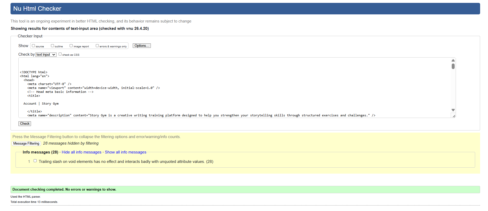
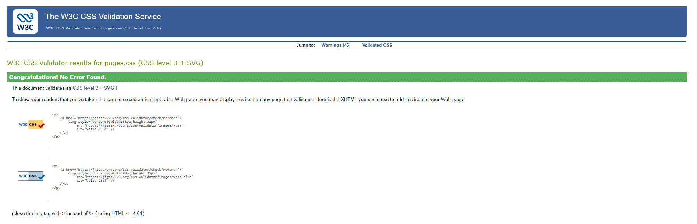
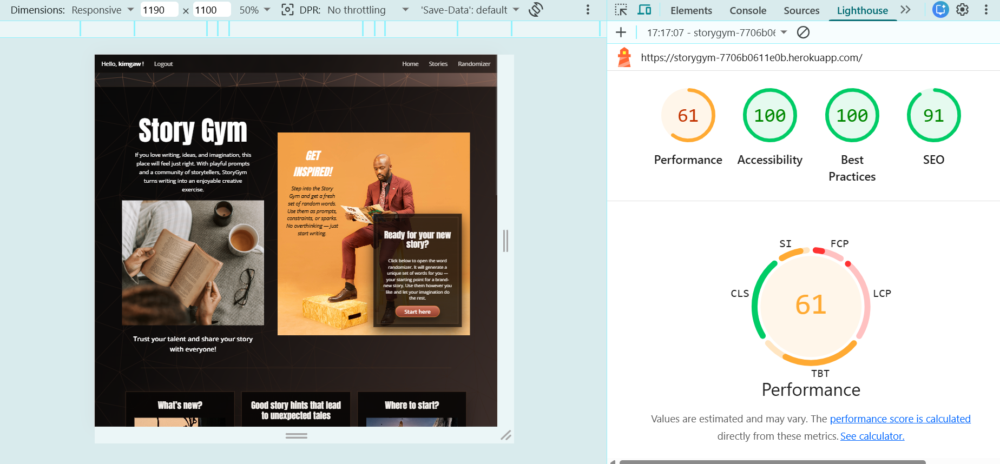

---

## HTML Validation (W3C Validator)

All rendered HTML pages were validated using the **W3C HTML Validator** to ensure compliance with HTML5 standards and best practices.

### Pages Validated

- Home
- Login
- Register
- Randomizer
- Story Editor
- Story Preview
- Repository
- Account
- Article Pages
- 404 Page

---

### Notes

The validator returned informational messages regarding trailing slashes on void elements (e.g. `<meta />`, ``).  

These are related to XHTML-style syntax and do not affect functionality in HTML5. The code remains valid and renders correctly across all tested browsers.

---

## HTML Validation Issues & Fixes

---

### Bug 1 — Label Association

**Error:**  
“The value of the for attribute of the label element must be the ID of a non-hidden form control.”

#### Cause
The `for` attribute in `<label>` elements did not match the corresponding `id` of the `<input>` fields.  
This caused a mismatch between labels and form controls, affecting both validation and accessibility.

#### Incorrect Example
```html
<label for="password">Password</label>
<input type="password" name="password1" id="password1">
```

#### Fix
```html
<label for="password1">Password</label>
<input type="password" name="password1" id="password1">
```

#### Outcome
- HTML validation errors resolved  
- Improved accessibility (screen readers correctly associate labels with inputs)  
- Maintained proper Django form field binding (`password1`, `password2`)  


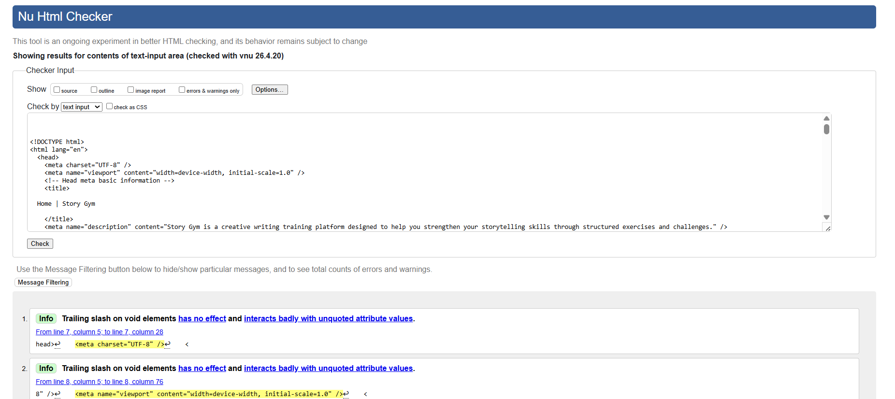
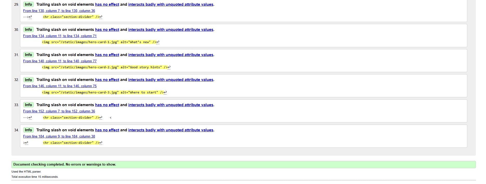


---

### Bug 2 — Semantic Structure Improvements

During validation, several warnings were identified related to improper semantic structure and accessibility.

#### Issues Identified

- Multiple `<h1>` elements on a single page  
- Use of `<section>` elements without associated headings  
- Empty heading elements (e.g. `<h2></h2>`)  
- Use of semantic elements (`<section>`) for layout purposes only  

#### Example of Issue

```html
<section class="article-block">
  <h1 class="article-title">What’s new?</h1>
</section>

<section class="article-block article-block--dark">
  ...
</section>

<h2 class="article-subtitle"></h2>
```

#### Fixes Implemented

- Ensured only one `<h1>` is used per page (page title)  
- Replaced layout-only `<section>` elements with `<div>`  
- Removed empty heading elements  
- Introduced appropriate semantic elements:
  - `<header>` for page title  
  - `<blockquote>` for quoted content  

#### Corrected Structure

```html
<header class="article-block">
  <h1 class="article-title">What’s new?</h1>
</header>

<div class="article-block article-block--dark">
  ...
</div>

<div class="article-block article-block--quote">
  <blockquote>
    <p>This is only the beginning — and the story of StoryGym is still being written</p>
  </blockquote>
</div>
```

#### Outcome

- Improved semantic HTML structure  
- Better accessibility for screen readers  
- Reduced HTML validation warnings  
- Clear separation between layout and meaningful content  

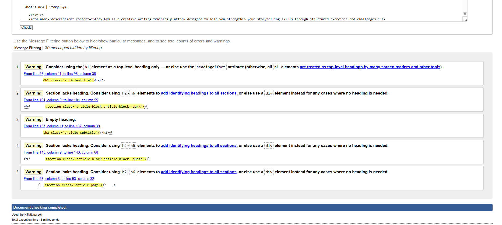

---

### Bug 3 — Sectioning and Heading Structure

During validation of the “Prompts for Storytelling” page, structural warnings were identified due to improper use of semantic elements.

#### Issues Identified

- Use of `<section>` elements for layout purposes only  
- Sections without associated heading elements  
- Incorrect heading hierarchy usage  

#### Example of Incorrect Implementation

```html
<section class="article-row article-row--two-cards">
  <div class="article-box">
    <h2>Where to Start When Writing a Story</h2>
  </div>
</section>
```

#### Problem

The `<section>` element is intended for meaningful content grouping and should include a heading describing the section.  
In this case, the headings were nested inside inner elements and did not represent the section itself, causing accessibility and validation warnings.

#### Fixes Implemented

- Replaced layout-only `<section>` elements with `<div>`  
- Retained `<section>` only where a clear top-level heading exists  
- Ensured a single `<h1>` is used per page  
- Maintained proper heading hierarchy (`h1 → h2`)  

#### Corrected Structure

```html
<div class="article-row article-row--two-cards">
  <div class="article-box">
    <h2>Where to Start When Writing a Story</h2>
  </div>
</div>
```

#### Outcome

- Improved semantic clarity of the document structure  
- Reduced HTML validation warnings  
- Enhanced accessibility for assistive technologies  
- Clear distinction between layout containers and meaningful content sections  

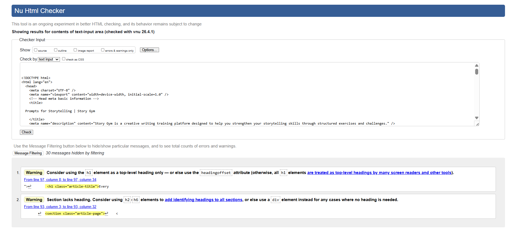
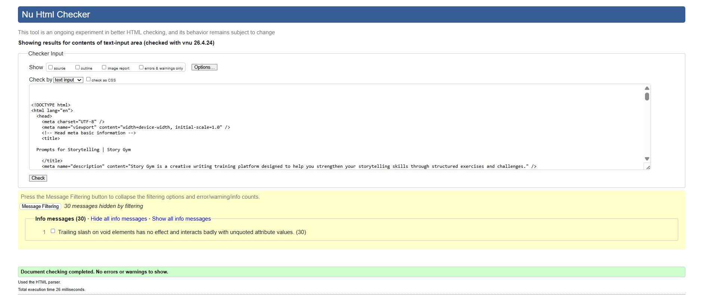

---

### Bug 4 — Layout vs Semantic Elements

During validation of the “Writing Tips” page, additional warnings were identified related to misuse of semantic elements.

#### Issues Identified

- Use of `<section>` elements for layout-only containers  
- Sections without associated headings  
- Mismatch between semantic intent and visual structure  

#### Example of Incorrect Implementation

```html
<section class="article-page">
  <section class="article-row article-row--split">
    ...
  </section>
</section>
```

#### Problem

The `<section>` element is intended for meaningful content grouping and should include a heading describing the section.  
In this case, these elements were used purely for layout, which caused validation warnings and reduced semantic clarity.

#### Fixes Implemented

- Replaced layout-only `<section>` elements with `<div>`  
- Ensured `<section>` is only used when paired with a relevant heading  
- Maintained a clear heading hierarchy with a single `<h1>` per page  
- Improved semantic consistency across all article pages  

#### Corrected Structure

```html
<div class="article-page">
  <div class="article-row article-row--split">
    ...
  </div>
</div>
```

#### Outcome

- Eliminated HTML validation warnings related to sectioning  
- Improved semantic structure of the document  
- Enhanced accessibility and screen reader interpretation  
- Clear distinction between content structure and layout styling  


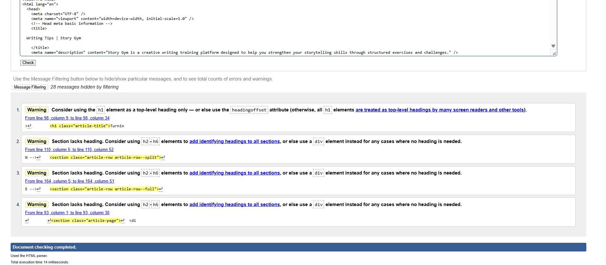
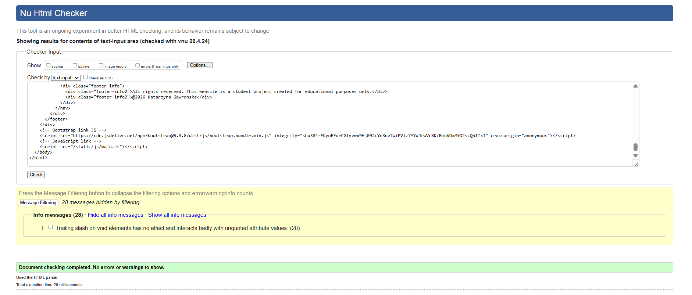

---

## Summary

The HTML validation process ensured that:

- All pages follow HTML5 standards  
- Semantic structure is correctly implemented  
- Accessibility is improved across the application  
- Validation warnings were resolved or justified  

The application now provides a **clean, accessible, and standards-compliant HTML structure** suitable for production deployment.
## CSS Validation (W3C Validator)

Custom CSS files were validated using the **W3C CSS Validator** to ensure correct syntax, consistency, and adherence to CSS standards.

### Files Checked

- `global.css`
- `pages.css`

---

## CSS Validation Issues & Fixes

---

### Issue 1 — SVG Property Warning

**Warning:**
> “Property `vector-effect` doesn't exist: non-scaling-stroke”

#### Cause

The following property was applied to SVG elements:

```css
.mesh-tri {
  vector-effect: non-scaling-stroke;
}
```

This property is part of the SVG specification and is used to prevent stroke scaling during transformations.

#### Explanation

The W3C CSS Validator does not fully support SVG-specific properties and may incorrectly flag them as errors. However, this property is valid and widely supported in modern browsers when applied to SVG elements.

#### Resolution

No changes were made, as the property is intentionally used and functions correctly.

#### Outcome

- Visual consistency of SVG elements preserved  
- No impact on browser compatibility  
- Identified as a validator limitation, not a code issue  

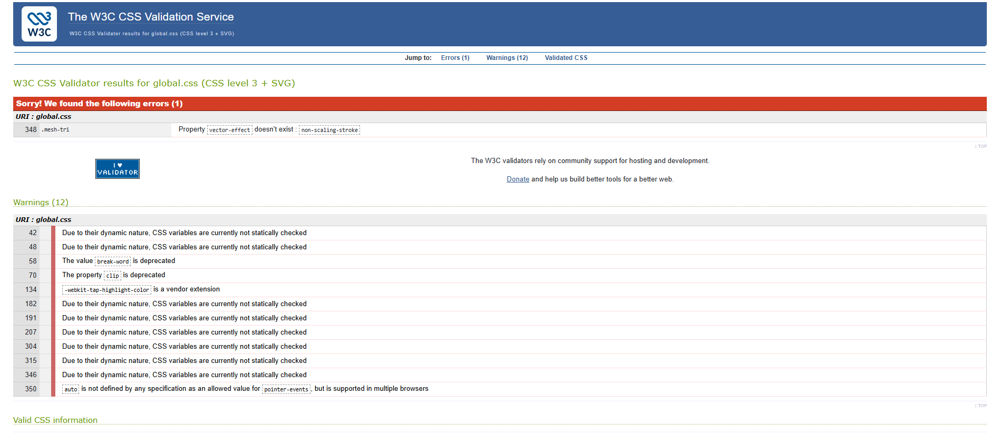

---

### Issue 2 — Incorrect Property Value

**Error:**
> “Too many values or values are not recognized”

#### Cause

A border value was incorrectly assigned to a `border-radius` property:

```css
border-top-right-radius: 1px solid rgba(176, 118, 88, 0.4);
```

The `border-top-right-radius` property accepts only length values and does not support border styling syntax.

#### Fix

The incorrect property was replaced with:

```css
border-top: 1px solid rgba(176, 118, 88, 0.4);
```

#### Outcome

- CSS validation error resolved  
- Correct use of CSS properties  
- Improved code clarity and maintainability  

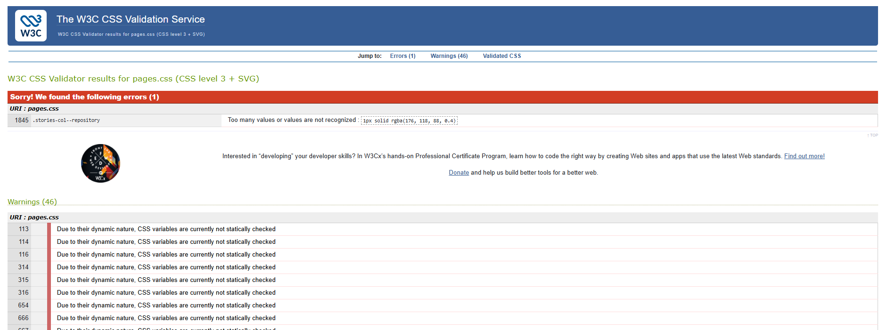


---

## Python / Django Validation

Python code was tested using a **PEP8-compliant linter**.

### Findings

- Minor `E501` (line too long) warnings identified  
- Occurred mainly in Django configuration settings (e.g. validators, email settings)

### Decision

These lines were intentionally left unchanged because:

- They contain long module paths and configuration values  
- Splitting them would reduce readability  
- This approach aligns with common Django practices  

### Outcome

- Code follows PEP8 guidelines with justified exceptions  
- Readability and maintainability preserved  

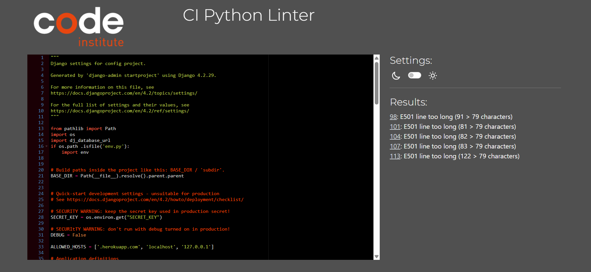
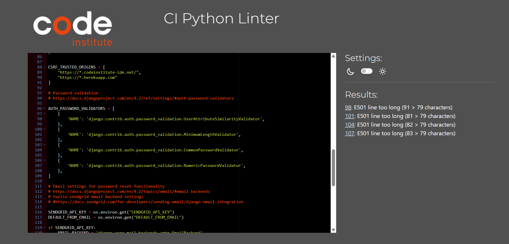

---

## JavaScript Validation (JSHint)

JavaScript code was validated using **JSHint** to ensure quality, readability, and maintainability.

---

### Results

- **13 functions** detected  
- **Cyclomatic complexity:**
  - Maximum: 3  
  - Median: 1  
- **Largest function:** 7 statements  
- **Median function size:** 3 statements  

These results indicate that the code is **modular, efficient, and easy to maintain**.

---

### Initial Warnings

JSHint reported warnings related to modern JavaScript (ES6) features, including:

- `const` and `let`  
- Arrow functions (`=>`)  
- Template literals  
- Destructuring  
- Object shorthand notation  

These occurred because JSHint defaults to ES5.

---

### Resolution

The following configuration was added at the top of the JavaScript file:

```js
/* jshint esversion: 6 */
```

This enables ES6 support in JSHint.

---

### Outcome

- All ES6-related warnings resolved  
- Code confirmed to follow modern JavaScript standards  
- Low complexity ensures good performance and readability  

---

### Notes

The JavaScript includes an interactive SVG-based polygon mesh background, enhancing user experience while maintaining efficient and clean code structure.

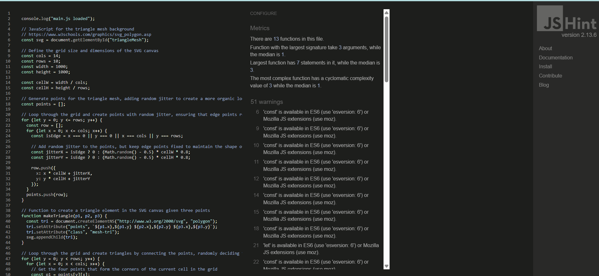
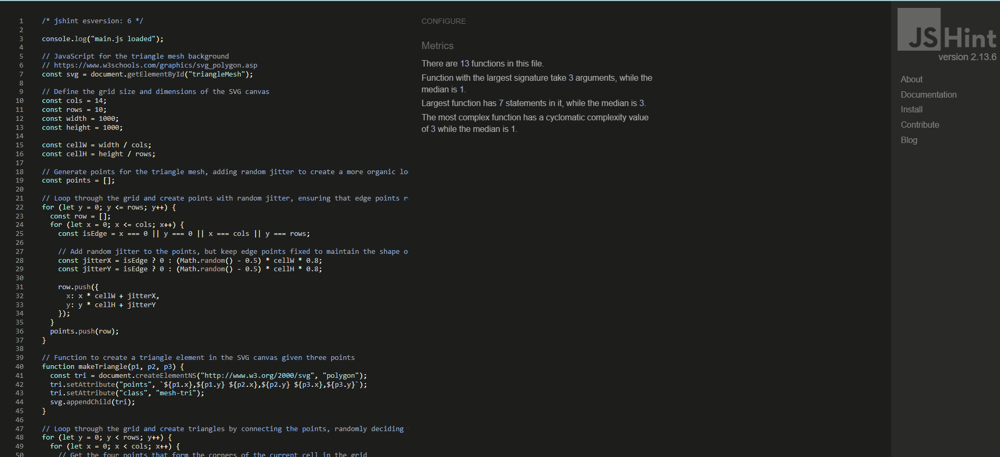

---

## Summary

- CSS validated with minor corrections and justified warnings  
- Python follows PEP8 with acceptable exceptions  
- JavaScript validated and updated to ES6 standards  

The validation confirms that the application code is **clean, maintainable, and aligned with modern development practices**.

## Lighthouse Testing

Lighthouse testing was conducted using Chrome DevTools to evaluate:

- Performance  
- Accessibility  
- Best Practices  
- SEO  

Testing was performed across both **desktop** and **mobile** views.

---

## Desktop Testing Results

Lighthouse tests were run on all key pages of the application.

### Summary

| Page | Performance | Accessibility | Best Practices | SEO |
|------|------------|--------------|----------------|-----|
| Home | 82 | 100 | 100 | 91 |
| Login | 97 | 100 | 100 | 100 |
| Register | 96 | 100 | 100 | 100 |
| Account | 92 | 100 | 100 | 100 |
| Story Repository | 92 | 100 | 100 | 90 |
| Story Editor | 90 | 100 | 100 | 100 |
| Story Preview | 85 | 100 | 100 | 100 |
| Randomizer | 95–96 | 100 | 100 | 100 |
| Articles | 80–93 | 100 | 100 | 100 |

---

### Key Observations

- Accessibility scored **100 across all pages**
- Best Practices scored **100**, confirming secure implementation
- SEO scored between **90–100**
- Performance ranged from **80–97**

---

### Performance Notes

Lower performance scores (80–85) were observed on:

- Home page  
- Article pages  
- Story preview page  

**Reasons:**
- Large hero/background images  
- Overlay effects and layered UI elements  
- Rendering cost of visual design  

---

### Optimisations Applied

- Images reviewed and optimised for web use  
- Layout structured to minimise layout shifts  
- Efficient CSS used for responsiveness  

---

### Future Improvements

- Convert images to WebP format  
- Implement lazy loading  
- Further compress large background images  

---

## Mobile Testing Results

Lighthouse testing was also conducted in mobile view using Chrome DevTools.

### Summary

| Page | Performance | Accessibility | Best Practices | SEO |
|------|------------|--------------|----------------|-----|
| Home | ~70–85 | 100 | 100 | 90+ |
| Login/Register | ~90+ | 100 | 100 | 100 |
| Account | ~85–90 | 100 | 100 | 100 |
| Repository | ~85–90 | 100 | 100 | 90+ |
| Randomizer | ~90+ | 100 | 100 | 100 |
| Articles | ~75–90 | 100 | 100 | 100 |

---

### Key Observations

- Accessibility remains **100 across all pages**
- UI is fully responsive and stable  
- No layout breaking or overflow issues detected  
- Navigation and forms are fully usable  

---

### Performance Notes

Performance is slightly lower due to:

- Simulated slower network conditions  
- Large background images  
- Rendering cost of visual effects  

---

### Mobile Optimisations

- Responsive layout using flexible containers  
- Images scale correctly across devices  
- Touch interactions tested and validated  

---

## Conclusion

Lighthouse testing confirms that the application:

- Meets accessibility standards (WCAG-friendly)  
- Follows modern best practices  
- Is SEO-friendly  
- Delivers strong performance overall  

Minor improvements are possible through further media optimisation.

The application is **fully functional, responsive, and provides a consistent user experience across all devices**.

---

## Bugs Found & Fixed

The following bugs were identified during final testing of the deployed application and responsive layouts.

### Bug - Password reset not working

**Issue:** Database connection changed after updating DATABASE_URL

**Description:**

After updating the DATABASE_URL environment variable on Heroku, the application stopped functioning correctly.

**Cause:**

The new database was empty and did not contain the required tables or data. As a result, the application could not retrieve or store information.

**Solution:**

Ran migrations on the new database:
heroku run python manage.py migrate --app storygym
Recreated superuser:
heroku run python manage.py createsuperuser --app storygym

**Outcome:**

The application successfully connected to the new database and resumed normal operation.

---

### Bug - TESTING 1 

**Issue:** Mobile Mesh Background Rendering Issue

**Description:**

On mobile and tablet devices, a thin grey/white line appeared at the bottom of the screen during scrolling. The issue disappeared when scrolling stopped and did not occur on desktop.

**Cause:**

This was caused by mobile browser repaint behaviour when using a fixed SVG background (.polygon-bg) combined with viewport resizing during scroll. Minor horizontal overflow also contributed.

**Fix:**

html,
body {
  overflow-x: hidden;
}

@media (max-width: 1024px) {
  .polygon-bg {
    height: 100dvh;
    min-height: 100dvh;
    transform: translateZ(0);
    backface-visibility: hidden;
  }
}

**Outcome:**

The rendering artifact was removed and the background now displays consistently across mobile and tablet devices.

---

### Bug - TESTING 2

**Issue:** Favicon icons returning 404 in production

**Description:**

Browser console showed 404 errors for:

/android-chrome-192x192.png

**Cause:**

Paths in site.webmanifest were pointing to the root directory instead of the /static/ folder.
The manifest file is not processed by Django templates, so  cannot be used.

**Fix:**

Updated icon paths in site.webmanifest:

"src": "/static/favicon/android-chrome-192x192.png"

**Result:**

Icons now load correctly in production, no more 404 errors.

---

### Bug - TESTING 3

**Issue:**  Article titles on the home page were not vertically centered within their containers.

**Cause:**

Missing vertical alignment in the grid layout for the <h3> element.

**Fix:**

Applied vertical centering using CSS:

.features-section .sg-card h3 {
    grid-column: 1;
    grid-row: 1;
    align-self: center;
}

**Result:**

Article titles are now properly centered across all screen sizes.

---

### Bug - TESTING 4

**Issue:**  Article images appeared slightly uneven in the one-column mobile layout.

**Cause:**

Overlapping responsive styles and small spacing rules affected the visual alignment of image blocks on mobile.

**Fix:**

Applied a mobile-only spacing adjustment to the article block/image layout.

**Result:**

Image alignment improved on small screens without affecting the desktop layout.

---

### Bug - TESTING 5 

**Issue:**  Story could be saved without selecting a genre

**Description:**

Users were able to save or publish a story without selecting a genre, even though genre is a required field.

Expected behavior:

The form should prevent submission unless a genre is selected.

Actual behavior:

The form submitted successfully with an empty genre field.

**Cause:**

The StoryForm did not explicitly enforce the genre field as required.
Additionally, Django automatically allows an empty option in ModelChoiceField when not configured otherwise.

**Fix:**

The genre field was explicitly defined in the form with required=True:

genre = forms.ModelChoiceField(
    queryset=Genre.objects.all(),
    required=True,
    empty_label="Select a genre"
)
**Result:**

Users must now select a genre before saving or publishing a story
Form validation correctly blocks submission when genre is missing
Error message is displayed to guide the user

---

### Bug - TESTING 6

**Issue:**  Submitting a story with invalid input (e.g. only spaces) did not provide any user feedback.

**Cause:**

Form validation errors were not displayed in the template.

**Fix:**

Added {{ form.field.errors }} to display validation messages for title and content fields.

**Result:**

Users now receive clear feedback when submission fails.

---

### Bug - TESTING 7

**Issue:**  Submitting a comment with invalid input (e.g. only spaces) did not provide any user feedback.

**Cause:**

Form validation errors were not displayed in the template.

**Fix:**

Added {{ comment_form.comment_text.errors }} to display validation messages for title and content fields.

**Result:**

Users now receive clear feedback when submission fails.

---

### Bug - TESTING 8

**Issue:**  Buttons in the comment section ("Edit" and "Delete") were misaligned on smaller screens.

* Buttons appeared too close together
* "Edit" button was shrinking compared to "Delete"
* Layout inconsistent across screen sizes

**Cause:**

* `display: flex` was removed, so `gap` stopped working
* Buttons were auto-sizing based on text length
* No minimum width defined

**Fix:**

* Used margin instead of `gap` (old-school spacing)
* Added `min-width` to prevent button shrinking
* Ensured consistent alignment and spacing

**Result:**

* Buttons aligned correctly
* Equal visual size
* Responsive layout improved

---

### Bug - TESTING 9

**Issue:**  Repository filters did not work correctly in all combinations. Genre filtering, title search, and sorting needed to work separately and together.

**Cause:**  

Filtering and sorting logic were mixed together, so selecting a genre could prevent the correct sorting logic from running.

**Fix:**  

Refactored the repository view so that:
- title search runs first
- genre filter runs second
- sorting runs last
- `selected_genre` is passed back to the template to keep the selected genre visible

**Result:**  

Repository now supports combined filtering by title, genre, and sorting by newest, oldest, or most liked. Stories without ratings are placed below rated stories when sorting by most liked.

---

### Bug - TESTING 10


**Issue:**   Background image appeared zoomed on pages with many stories in Account Page.

**Cause:**  

The background was applied to a container whose height grows dynamically with content. With more content, the background scaled excessively due to `background-size: cover`.

**Fix:**  

Moved background to a stable wrapper container and kept content panel with semi-transparent overlay.

**Result:**  

Background remains visually consistent regardless of content length.

---

### Bug - TESTING 11

**Issue:**  Divider line remained visible on mobile view despite being removed (CSS Border Conflict Issue) - Repo page.

**Cause:**  

Conflicting CSS declarations (`border-left: 0;` and `border-left: 1px solid`) were present in the same rule block. The later declaration overrode the previous one.

**Fix:**  

Removed duplicate declaration and applied proper media query to control border visibility.

**Result:**  

Divider behaves correctly in both desktop (visible) and mobile (hidden) layouts.

---

### Bug - TESTING 12


**Issue:**  Divider line remained visible on mobile view despite being removed (CSS Border Conflict Issue) - Preview page

**Cause:**  

 `border-left: 1px solid` were present, but not needed for the one column view. 

**Fix:**  

Removed border-left from the code.

**Result:**  

No divider present as no needed.

---

### Bug - TESTING 13

**Change:**  

Increased the size/space of the Story Repository section.

**Reason:** 

The repository area needed more room to display story titles, metadata, ratings, and action buttons clearly, especially on responsive layouts.

**Fix:**  

Adjusted repository layout sizing/spacing so the story list has better visual balance and readability.

**Result:**  

Story entries are easier to scan, with improved spacing and a cleaner responsive layout.

---

### Bug - TESTING 14

**Issue:**  Content inside the main surface container appeared too close to the edges, especially on smaller screens.

**Cause:**  

Horizontal padding was not applied, leading to tight layout spacing.

**Fix:**  

Added responsive horizontal padding to `.main-surface` to improve spacing across screen sizes.

**Result:**  

Content is better spaced and more readable on both mobile and desktop without layout overflow.

---

### Bug - TESTING 15

**Issue:**  Story action buttons on the Account page became misaligned on medium screen sizes (Account Page Button Layout Fix)

**Cause:**  

The layout worked on desktop and mobile, but the middle screen range did not have a specific responsive rule. Buttons were being squeezed inside the story row grid.

**Fix:**  

Added a mid-screen media query for the Account page story rows. The row layout was adjusted so the story title, date, and action buttons are placed more clearly, with buttons stacked neatly on the right.

**Result:**  

Account page story actions now display correctly across desktop, tablet, and mobile screen sizes.

---

### Bug - TESTING 16

**Change:**  

Moved the "Delete story" button slightly below the main action buttons.

**Reason:**  

To reduce the risk of accidental clicks by separating destructive actions from primary actions.

**Result:**  

Improved usability and safer interaction by clearly distinguishing between regular and destructive actions.

---

## Development Debugging Process

The following bugs were identified during the build process and are linked to the `Debug` commit history. These are separate from the final testing bugs listed above.

## Bug 1 — Missing Open Graph Image Meta Tag

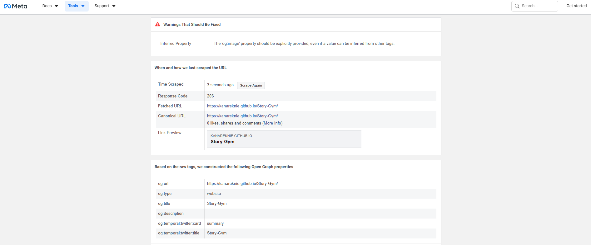

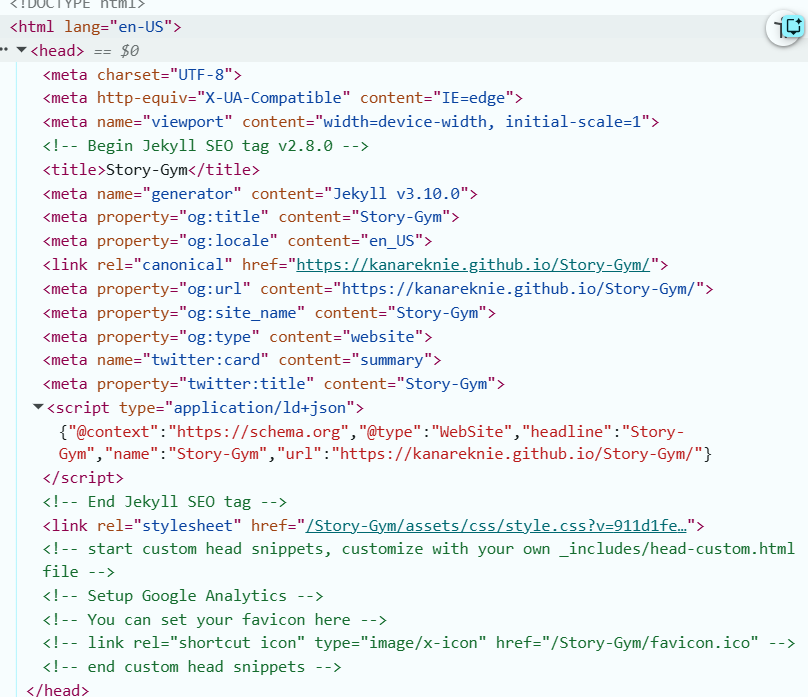

| Field | Details |
|---|---|
| **Issue** | The Meta inspection tool showed a warning that the `og:image` property was missing. This meant the shared page link could display without a proper preview image on social platforms. |
| **Cause** | The page included Open Graph tags such as `og:title`, `og:url`, `og:site_name`, and `og:type`, but no explicit `og:image` meta tag was provided. |
| **Fix** | Added an `og:image` meta tag to the page `<head>` section, pointing to a valid image URL for the project preview. |
| **Result** | The warning was resolved and the application now generates proper link previews when shared externally. |
| **Commit** | Debug 1 - Meta inspection issue |

---

## Bug 2 — CSS Validation Errors on Randomizer Page

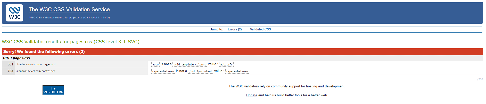

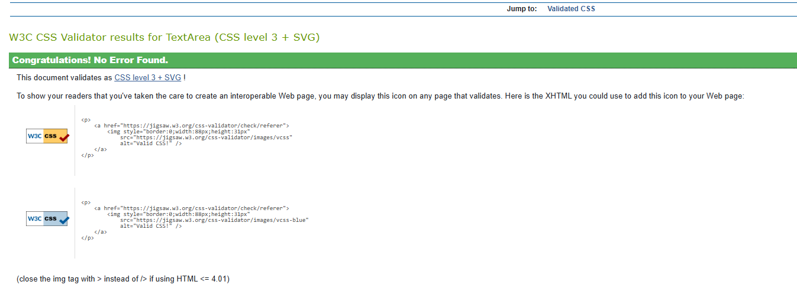

| Field | Details |
|---|---|
| **Issue** | The W3C CSS Validator reported errors in `pages.css`, specifically invalid values for `grid-template-columns` and `justify-content`. |
| **Cause** | Incorrect CSS values were used: `auto,1fr` was not valid syntax for `grid-template-columns`, and `cspace-between` was a typo instead of the correct `space-between` for `justify-content`. |
| **Fix** | Corrected the CSS syntax by updating `grid-template-columns` to a valid format (e.g., `auto 1fr`) and fixing the typo to `justify-content: space-between`. |
| **Result** | The CSS passed W3C validation successfully with no errors, ensuring better standards compliance and cross-browser consistency. |
| **Commit** | Debug 2 - CSS validation fix |

---

---

## Bug 3 — Find Page Error (Application Crash)

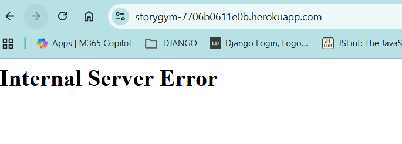

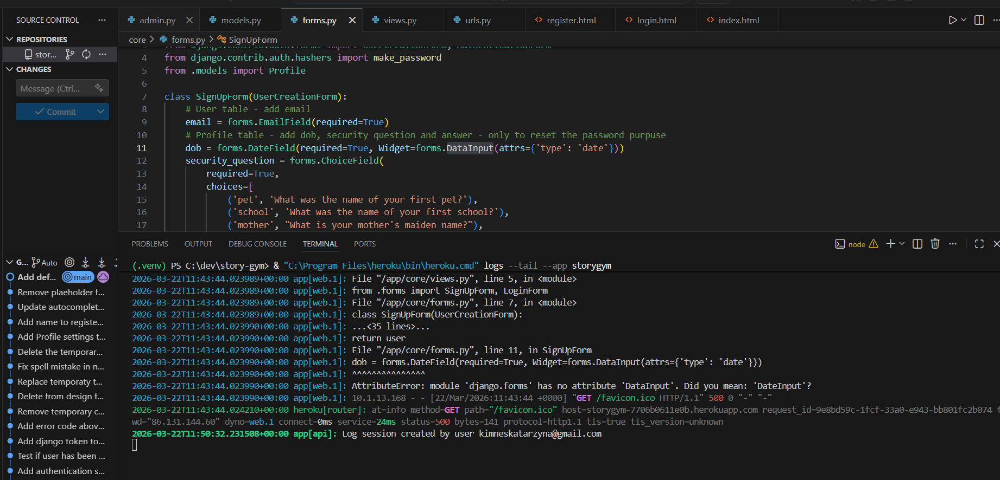

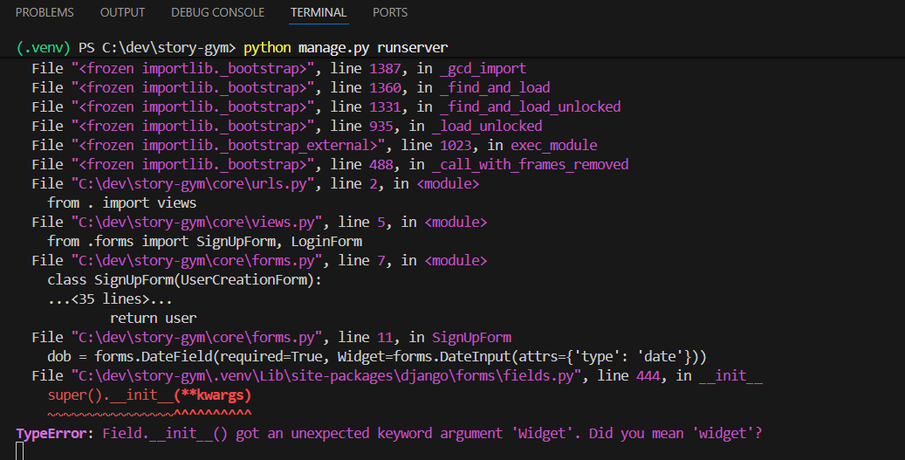

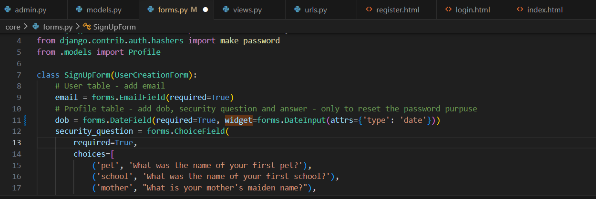

| Field | Details |
|---|---|
| **Issue** | The “Find” page caused the application to crash, displaying a Django error page instead of loading results. |
| **Cause** | There was an issue in the view logic handling the Find functionality, likely due to incorrect query handling or missing context data being passed to the template. This resulted in the template attempting to access undefined variables, triggering a server error. |
| **Fix** | Updated the view to correctly handle the query and ensured all required context variables were passed to the template. Additional checks were added to prevent errors when no data was available. |
| **Result** | The Find page now loads correctly without errors, and search functionality works as expected. |
| **Commit** | Debug 3 - Find page error resolved |

---

## Bug 4 — Unclosed Template Tag

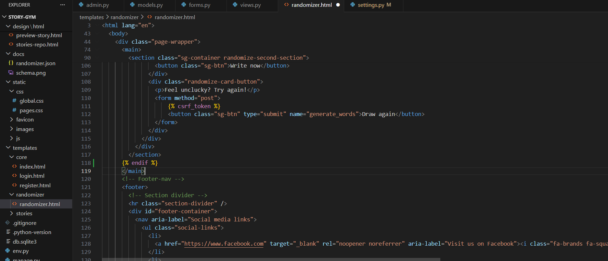

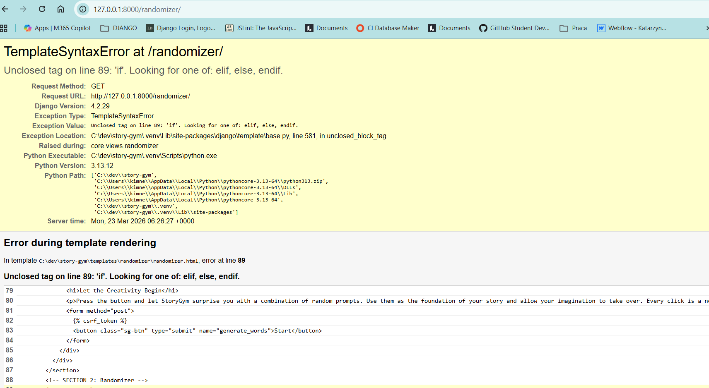

| Field | Details |
|---|---|
| **Issue** | The application failed to run correctly because Django detected a template syntax error. |
| **Cause** | A Django template block was opened but not closed correctly. The error showed that an `` statement was missing its matching `` tag. |
| **Fix** | Reviewed the template structure and added the missing `` closing tag in the correct position. |
| **Result** | The template rendered correctly and the server was able to run without the template syntax error. |
| **Commit** | Debug 4 - Resolve end tag |

---

## Bug 5 — Start Button Not Working (Runserver Error)

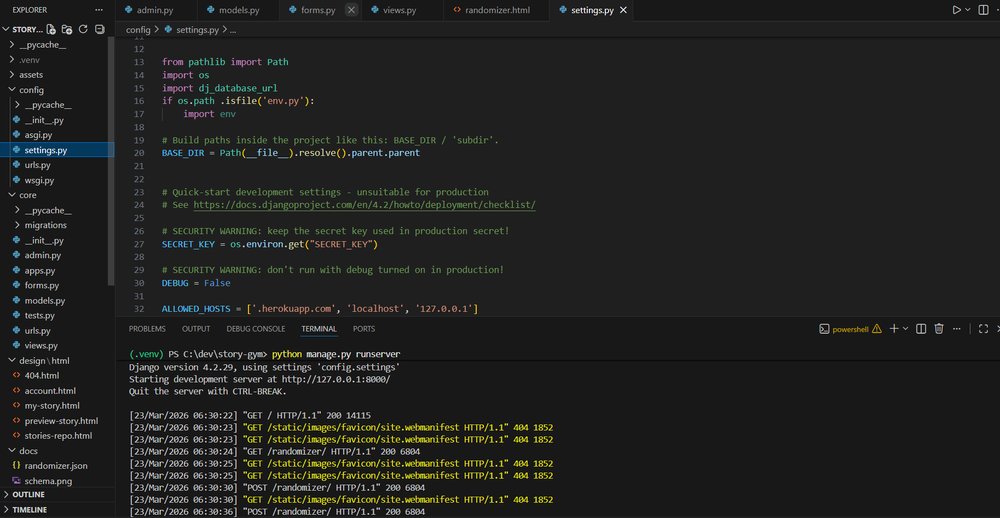

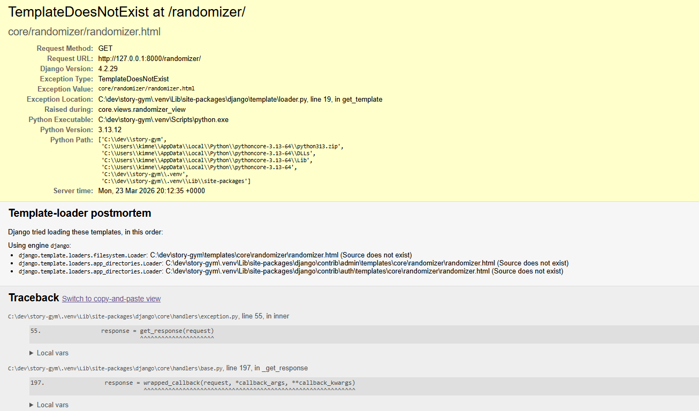

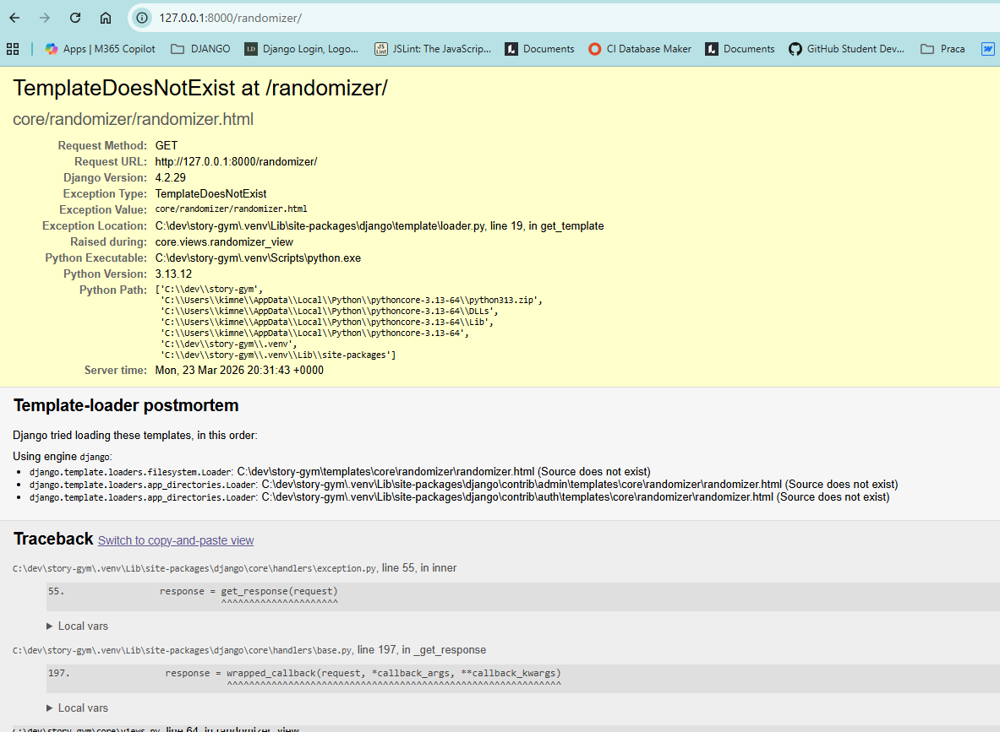

| Field | Details |
|---|---|
| **Issue** | The “Start” button did not work and triggered a server error when clicked, preventing the user from progressing in the application. |
| **Cause** | The button was linked to a view or URL that was not correctly configured. This resulted in a Django runserver error, likely due to a missing or incorrectly defined URL pattern or view function. |
| **Fix** | Corrected the URL configuration and ensured the button was properly connected to an existing view. Verified that the corresponding view handled the request correctly. |
| **Result** | The “Start” button now works as intended, successfully navigating the user to the next step without errors. |
| **Commit** | Debug 5 - Start button fix |

---

## Bug 6 — My Story Template Path Issue

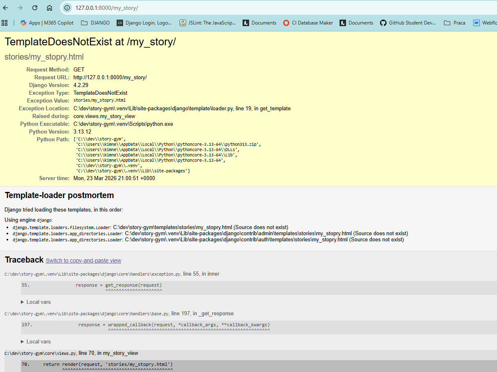

| Field | Details |
|---|---|
| **Issue** | The “My Story” page failed to load, resulting in a Django template error instead of rendering the page. |
| **Cause** | The template path referenced in the view was incorrect or did not match the actual file structure. Django could not locate the specified template file. |
| **Fix** | Updated the template path in the view to match the correct directory structure (e.g., `app_name/template_name.html`). Ensured the template file existed in the proper templates folder. |
| **Result** | The “My Story” page now loads correctly and renders the intended content. |
| **Commit** | Debug 6 - Fix template path |

---

## Bug 7 — Duplicate Input Fields in Form

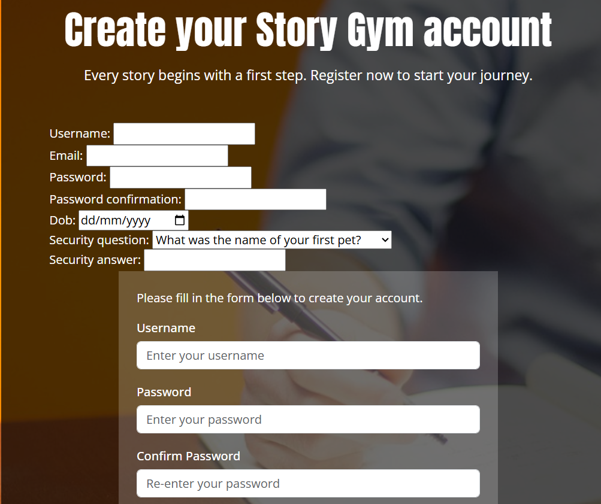

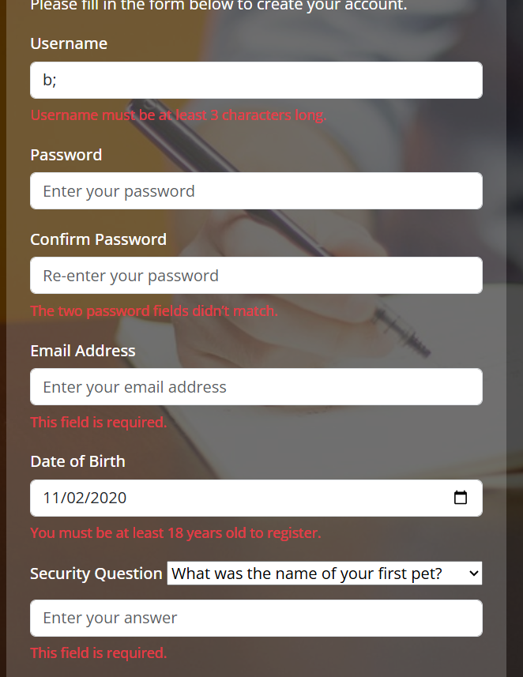

| Field | Details |
|---|---|
| **Issue** | Form fields were displayed twice on the page, causing a confusing user experience and potential duplicate data input. |
| **Cause** | The same form fields were rendered more than once, likely due to combining automatic form rendering (e.g., `{{ form.as_p }}`) with manual field markup in the template. |
| **Fix** | Removed the duplicate rendering method and ensured each form field was only defined once in the template. |
| **Result** | The form now displays correctly with a single set of input fields, improving usability and preventing duplicate input. |
| **Commit** | Debug 7 - Remove duplicate inputs |

---

## Bug 8 — Future Date Validation Issue

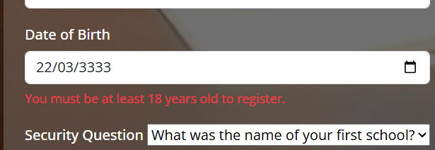

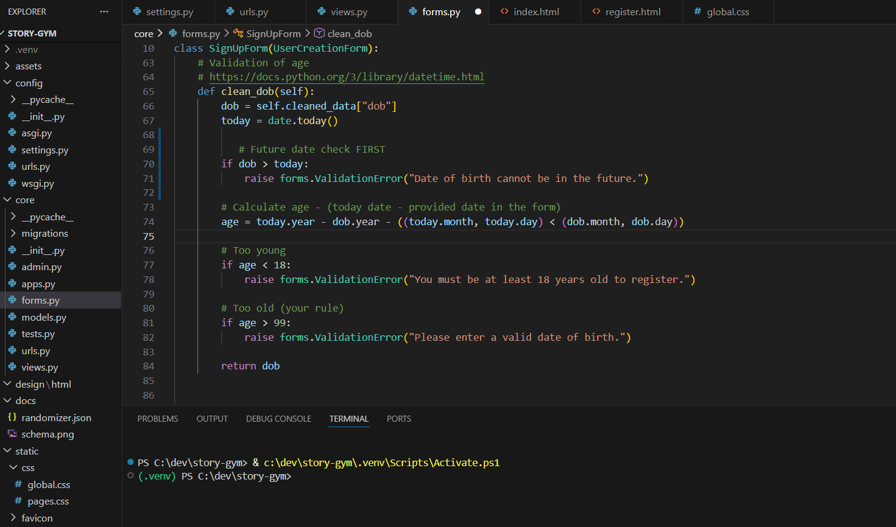

| Field | Details |
|---|---|
| **Issue** | The application allowed users to select or submit a future date where it should not be permitted, leading to invalid data being accepted. |
| **Cause** | Missing validation on the date field (either in the form or model) meant there was no restriction preventing future dates from being entered. |
| **Fix** | Implemented validation to restrict the date field to the current date or earlier. This was done using Django form validation (e.g., `clean_<field>()`) or model validation to compare against the current date. |
| **Result** | The form now correctly prevents future dates from being submitted, ensuring valid and consistent data. |
| **Commit** | Debug 8 - Future date validation fix |

---

## Bug 9 — “Write Now” Story Submission Error

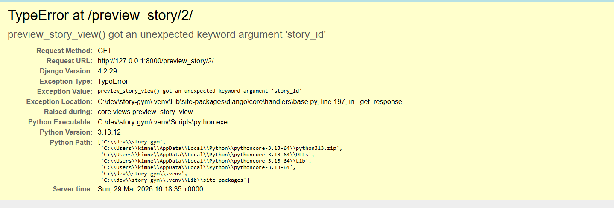

| Field | Details |
|---|---|
| **Issue** | Submitting the “Write Now” story form caused a server error, preventing the story from being saved. |
| **Cause** | The form submission was not handled correctly in the view. This was likely due to missing `POST` handling, incorrect form validation flow, or required fields not being properly processed before saving. |
| **Fix** | Updated the view to properly handle `POST` requests, validated the form using `form.is_valid()`, and ensured all required fields were correctly saved to the database. |
| **Result** | The story submission now works correctly, and users can successfully create and save their stories. |
| **Commit** | Debug 9 - Fix story submission |

---

## Bug 10 — Comment Form Fields Not Displayed

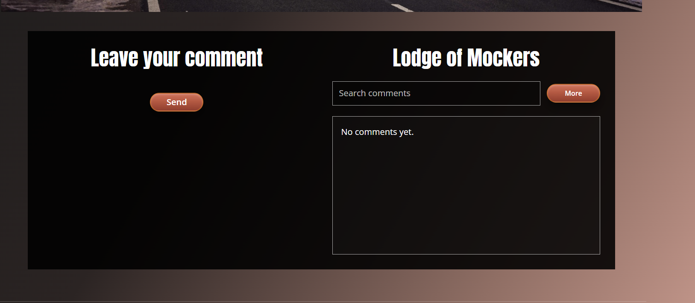

| Field | Details |
|---|---|
| **Issue** | The comment section was visible, but input fields (e.g., text area, submit button) were missing, preventing users from adding comments. |
| **Cause** | The comment form was not properly rendered in the template. This could be due to the form not being passed in the view context or the template missing the form rendering code (e.g., `{{ form }}` or specific fields). |
| **Fix** | Updated the view to include the comment form in the context and ensured the template correctly rendered the form fields and submit button. |
| **Result** | The comment form now appears correctly, allowing users to submit comments without issues. |
| **Commit** | Debug 10 - Add comment fields |

---

## Bug 11 — Account Page Error

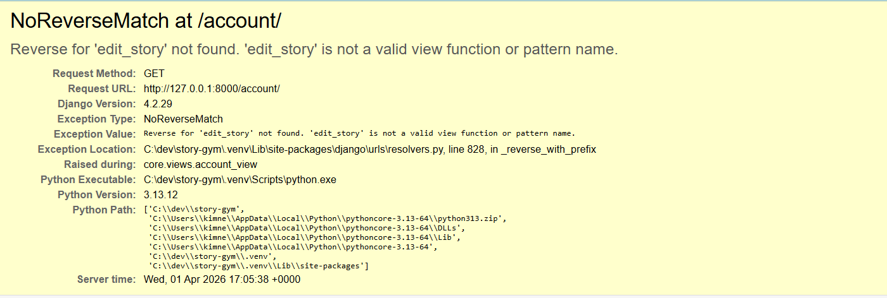

| Field | Details |
|---|---|
| **Issue** | The Account page failed to load correctly and displayed a server error instead of user account information. |
| **Cause** | The view responsible for rendering the account page did not correctly handle user-related data. This may have been due to missing context variables, incorrect query usage, or assumptions about authenticated user data that were not met. |
| **Fix** | Updated the view to properly retrieve and pass the authenticated user’s data to the template. Added checks to ensure the user is authenticated before accessing account-related information. |
| **Result** | The Account page now loads correctly and displays the expected user information without errors. |
| **Commit** | Debug 11 - Fix account page |

---

## Bug 12 — URL Configuration Error (Runserver)

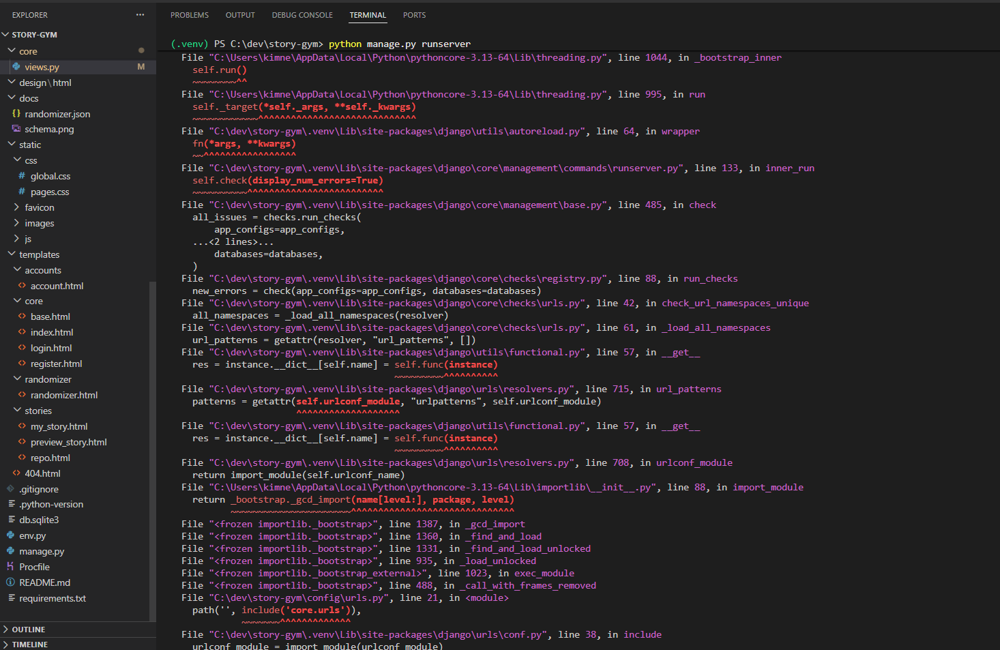

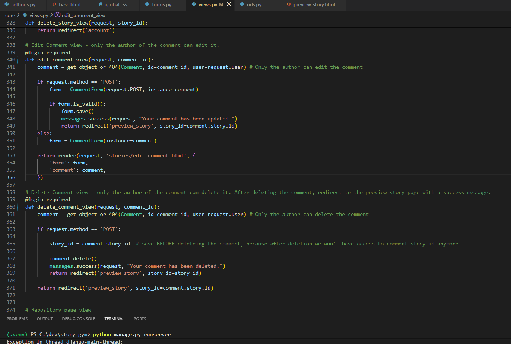

| Field | Details |
|---|---|
| **Issue** | The application failed to run due to a URL configuration error shown in the terminal when starting the development server. |
| **Cause** | There was an issue in the Django `urls.py` configuration, such as an incorrect import, missing view reference, or invalid path definition, causing Django to fail during URL resolution. |
| **Fix** | Reviewed and corrected the `urls.py` file by fixing the incorrect path or import and ensuring all referenced views existed and were properly connected. |
| **Result** | The server started successfully without errors, and all routes became accessible again. |
| **Commit** | Debug 12 - Fix URL configuration |

---

## Bug 13 — Comment Edit Error

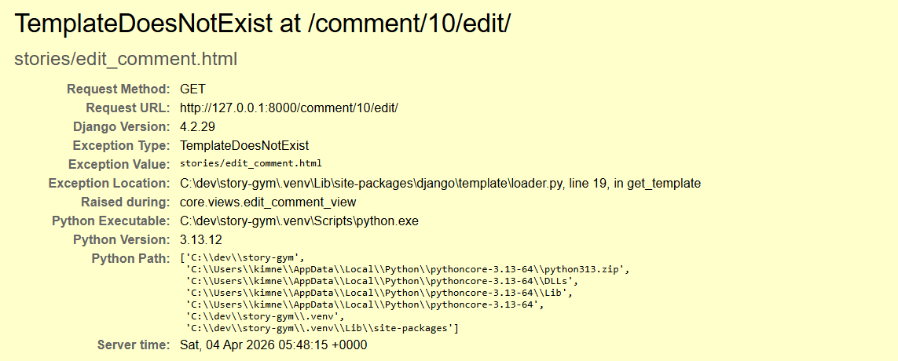

| Field | Details |
|---|---|
| **Issue** | Editing a comment caused an error instead of updating the existing comment. |
| **Cause** | The edit functionality did not correctly bind the existing comment instance to the form, or the view did not properly handle the update logic (e.g., missing `instance=comment` in the form). |
| **Fix** | Updated the edit view to pass the correct comment instance into the form and ensured the form submission updates the existing record rather than creating a new one. |
| **Result** | Comments can now be edited successfully, and changes are saved correctly. |
| **Commit** | Debug 13 - Fix comment edit |

---

## Bug 14 — Character Counter Not Updating

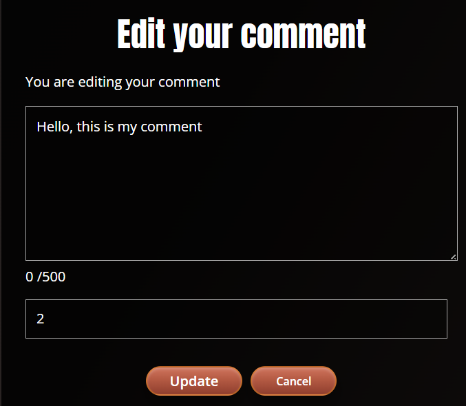

| Field | Details |
|---|---|
| **Issue** | The character counter did not update while the user was typing, providing no feedback on input length. |
| **Cause** | The JavaScript responsible for tracking input length was not properly attached to the input field, or the event listener (e.g., `input` event) was missing or incorrectly implemented. |
| **Fix** | Added or corrected the JavaScript event listener to track user input in real time and update the character counter dynamically. |
| **Result** | The character counter now updates live as the user types, improving usability and input awareness. |
| **Commit** | Debug 14 - Fix character counter |

---

## Bug 15 — Integer Not Iterable Error

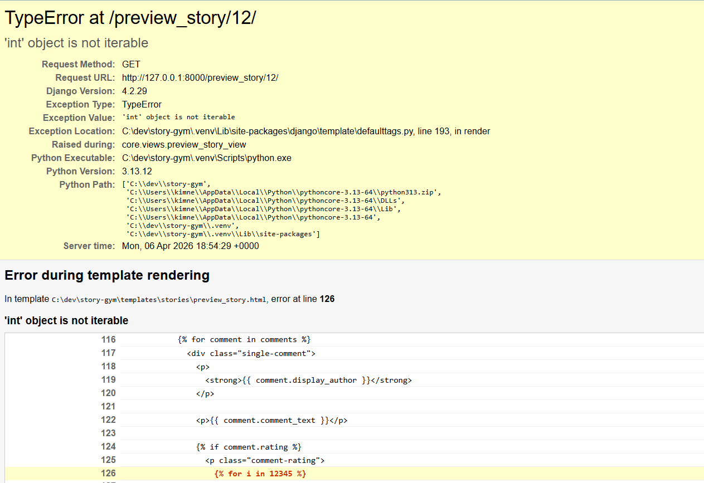

| Field | Details |
|---|---|
| **Issue** | The application crashed with a TypeError indicating that an integer object is not iterable. |
| **Cause** | A loop in the template or view attempted to iterate over an integer value instead of an iterable (e.g., list or queryset). This commonly happens when passing a count instead of a collection to the template. |
| **Fix** | Updated the logic to pass an iterable object (such as a list, range, or queryset) instead of a raw integer. Alternatively, used `range()` when iteration over a numeric value was intended. |
| **Result** | The error was resolved and the page now renders correctly without crashing. |
| **Commit** | Debug 15 - Fix integer iteration |

---

## Bug 16 — My Story Form Template Rendering Issue

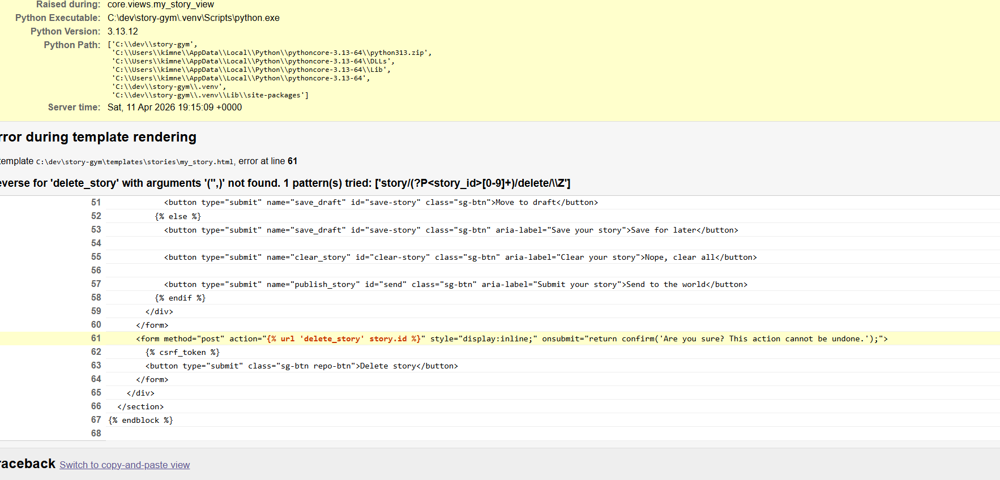

| Field | Details |
|---|---|
| **Issue** | The “My Story” form did not render correctly, causing layout issues or missing form elements on the page. |
| **Cause** | The template did not properly render the Django form, possibly due to missing form fields in the template or incorrect usage of form rendering (e.g., mixing manual fields with automatic rendering incorrectly). |
| **Fix** | Updated the template to correctly render the form fields, ensuring consistency between the form definition and template output. Cleaned up duplicated or missing elements. |
| **Result** | The form now displays correctly with all expected fields and proper layout. |
| **Commit** | Debug 16 - Fix My Story form template |

---

## Known Issues / Improvements

### Improvement 1

**Issue:** Genre dropdown empty after database reset

**Description:**
After resetting the database, the genre dropdown in the story creation form appeared empty.

**Cause:**
The database reset removed all existing data, including predefined Genre entries.
While the model structure remained intact, no genre records were available for the form queryset.

**Fix:**
Re-populated the Genre model using Django admin.

**Result:**
Genre dropdown now correctly displays available options.

---

### Improvement 2

**Test:**
Clicked the contact email link on mobile and desktop.

**Result:**
The link opened the email app correctly on mobile. On desktop, behaviour depended on the user’s local email app/browser configuration.

**Outcome:**
Not treated as a website bug because mailto: links require a configured email client on the device.

**Important:** check that your code has mailto::

<a href="mailto:storygym@email.com">storygym@email.com</a>

---

### Improvement 3

  Button hierarchy standardised:  

- Primary actions use `sg-btn`  
- Secondary actions (Cancel) use `black-btn`  
- Destructive actions (Delete) use `danger-btn`  

**Result:** Improved usability and reduced risk of user error

---

## Testing Summary

Story Gym was tested across **desktop, tablet, and mobile** layouts using a combination of:
- manual interaction testing
- responsive inspection
- edge-case checks
- Django workflow checks
- CRUD and permission testing
- JavaScript behaviour testing
- defensive/security-aware validation

The application was tested not only for the **happy path**, but also for:
- invalid inputs
- protected-route access
- URL tampering attempts
- empty-state rendering
- repeated actions
- long-content resilience
- cross-device usability

This testing approach demonstrates that Story Gym is not only visually styled, but also **functionally structured, defensive in behaviour, and appropriate for a database-backed full-stack application**.
