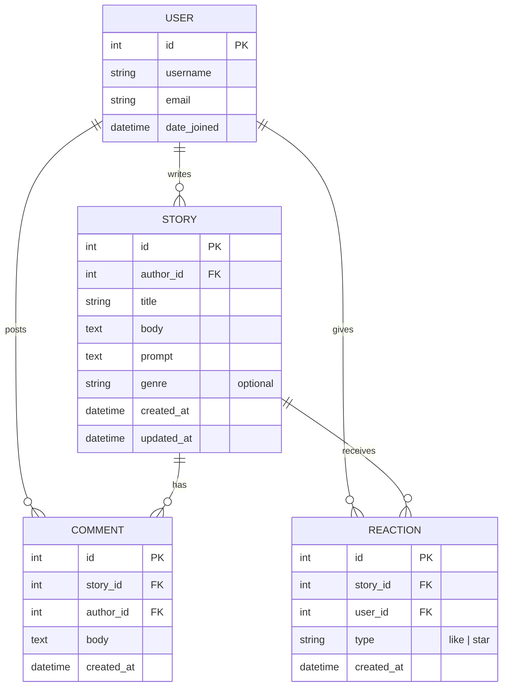

# Database Schema Diagram

```mermaid
erDiagram
    USER ||--o{ STORY : writes
    USER ||--o{ COMMENT : posts
    STORY ||--o{ COMMENT : has

    %% Optional reactions (likes or stars)
    USER ||--o{ REACTION : gives
    STORY ||--o{ REACTION : receives

    USER {
      int id PK
      string username
      string email
      datetime date_joined
    }

    STORY {
      int id PK
      int author_id FK
      string title
      text body
      text prompt
      string genre "optional"
      datetime created_at
      datetime updated_at
    }

    COMMENT {
      int id PK
      int story_id FK
      int author_id FK
      text body
      datetime created_at
    }

    REACTION {
      int id PK
      int story_id FK
      int user_id FK
      string type "like | star"
      datetime created_at
    }
```
